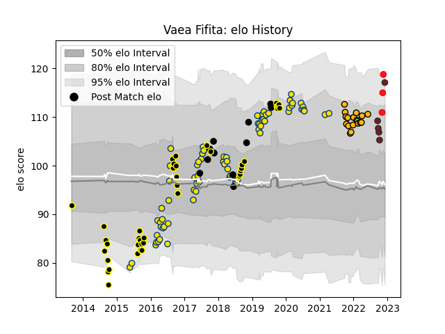

---  
layout: page  
title: Vaea Fifita  
date: 2022-11-16 11:41:38.522567  
categories: player  
---
# Vaea Fifita

## Positions: FL, L

## Country: Tonga

## Current elo: 115.0

## Current Percentile: 89.0

# Elo History

# Match History

| Team        |   Appearances |   Win Rate |
|:------------|--------------:|-----------:|
| Hurricanes  |            71 |   0.71831  |
| Wellington  |            41 |   0.54878  |
| Wasps       |            18 |   0.5      |
| New Zealand |            11 |   0.954545 |
| Scarlets    |             4 |   0.125    |
| Tonga       |             2 |   1        |

| Opponent                 |   Matches |   Win Rate |
|:-------------------------|----------:|-----------:|
| Blues                    |        11 |   0.727273 |
| Chiefs                   |        10 |   0.75     |
| Crusaders                |         9 |   0.333333 |
| North Harbour            |         7 |   0.714286 |
| Highlanders              |         6 |   0.666667 |
| Sharks                   |         5 |   0.8      |
| Jaguares                 |         4 |   0.75     |
| Otago                    |         4 |   0.5      |
| Waikato                  |         4 |   0.5      |
| Northland                |         4 |   0.75     |
| Lions                    |         4 |   0.75     |
| Brumbies                 |         4 |   0.75     |
| Taranaki                 |         4 |   0.5      |
| Hawke's Bay              |         3 |   0.166667 |
| Melbourne Rebels         |         3 |   1        |
| France                   |         3 |   1        |
| Argentina                |         3 |   1        |
| Counties Manukau         |         3 |   0.666667 |
| Stormers                 |         3 |   0.666667 |
| Southland                |         3 |   1        |
| Tasman                   |         3 |   0        |
| New South Wales Waratahs |         2 |   1        |
| Auckland                 |         2 |   0.5      |
| Northampton Saints       |         2 |   0.5      |
| Newcastle Falcons        |         2 |   0.5      |
| Harlequins               |         2 |   0        |
| Gloucester Rugby         |         2 |   0.5      |
| Exeter Chiefs            |         2 |   0.5      |
| Sunwolves                |         2 |   1        |
| Canterbury               |         2 |   0.5      |
| Bulls                    |         2 |   0.5      |
| Western Force            |         2 |   1        |
| Bath Rugby               |         2 |   1        |
| Southern Kings           |         1 |   1        |
| Spain                    |         1 |   1        |
| Samoa                    |         1 |   1        |
| South Africa             |         1 |   0.5      |
| Ulster                   |         1 |   0        |
| Scotland                 |         1 |   1        |
| Saracens                 |         1 |   1        |
| London Irish             |         1 |   1        |
| Sale Sharks              |         1 |   0        |
| Queensland Reds          |         1 |   1        |
| Ospreys                  |         1 |   0.5      |
| Manawatu                 |         1 |   0        |
| Leicester Tigers         |         1 |   0        |
| Japan                    |         1 |   1        |
| Italy                    |         1 |   1        |
| Chile                    |         1 |   1        |
| Cheetahs                 |         1 |   1        |
| Cardiff Blues            |         1 |   0        |
| British and Irish Lions  |         1 |   0.5      |
| Bristol Rugby            |         1 |   1        |
| Benetton Treviso         |         1 |   0        |
| Bay of Plenty            |         1 |   1        |
| Worcester Warriors       |         1 |   0        |