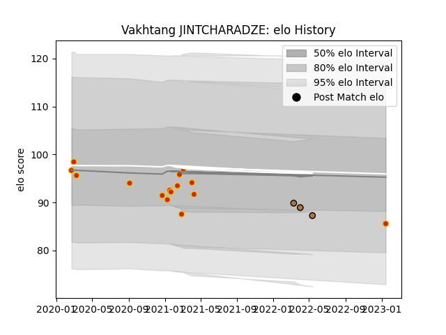

---  
layout: page  
title: Vakhtang JINTCHARADZE  
date: 2023-01-23 15:31:27.607392  
categories: player  
---
# Vakhtang JINTCHARADZE

## Positions: P

## Current elo: 88.0

## Current Percentile: None

# Elo History

# Match History

| Team      |   Appearances |   Win Rate |
|:----------|--------------:|-----------:|
| Perpignan |            16 |    0.71875 |
| Narbonne  |             3 |    0       |

| Opponent                   |   Matches |   Win Rate |
|:---------------------------|----------:|-----------:|
| Biarritz Olympique         |         3 |   0.666667 |
| Colomiers                  |         2 |   0.5      |
| Aurillac                   |         1 |   0.5      |
| Beziers                    |         1 |   0        |
| Bristol Rugby              |         1 |   0        |
| Carcassonne                |         1 |   1        |
| Glasgow Warriors           |         1 |   0        |
| Mont-de-Marsan             |         1 |   1        |
| Montauban                  |         1 |   1        |
| Nevers                     |         1 |   0        |
| Oyonnax                    |         1 |   1        |
| Provence Rugby             |         1 |   1        |
| Rouen                      |         1 |   1        |
| Soyaux-Angouleme           |         1 |   1        |
| Valence Romans Drome Rugby |         1 |   1        |
| Vannes                     |         1 |   0        |