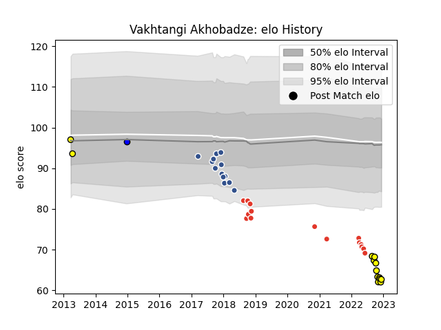

---  
layout: page  
title: Vakhtangi Akhobadze  
date: 2022-12-18 16:23:58.107893  
categories: player  
---
# Vakhtangi Akhobadze

## Positions: P

## Current elo: 60.0

## Current Percentile: 0.0

# Elo History

# Match History

| Team               |   Appearances |   Win Rate |
|:-------------------|--------------:|-----------:|
| Biarritz Olympique |            15 |   0.266667 |
| Agen               |            13 |   0.153846 |
| Carcassonne        |            12 |   0.25     |
| Albi               |             2 |   0.5      |
| Massy              |             1 |   0        |

| Opponent            |   Matches |   Win Rate |
|:--------------------|----------:|-----------:|
| Provence Rugby      |         3 |   0.333333 |
| Pau                 |         3 |   0        |
| Agen                |         2 |   0.5      |
| Montpellier Herault |         2 |   0        |
| Vannes              |         2 |   0        |
| Stade Toulousain    |         2 |   0        |
| Soyaux-Angouleme    |         2 |   0        |
| Racing 92           |         2 |   0        |
| Oyonnax             |         2 |   0        |
| Nevers              |         2 |   1        |
| Mont-de-Marsan      |         2 |   0        |
| Colomiers           |         2 |   0        |
| Clermont Auvergne   |         2 |   0        |
| Carcassonne         |         2 |   1        |
| Zebre               |         2 |   0.5      |
| La Rochelle         |         1 |   0        |
| Massy               |         1 |   0        |
| Aurillac            |         1 |   1        |
| Grenoble            |         1 |   0        |
| Gloucester Rugby    |         1 |   0        |
| Dax                 |         1 |   1        |
| Castres Olympique   |         1 |   0        |
| Rouen               |         1 |   1        |
| Biarritz Olympique  |         1 |   0        |
| Toulon              |         1 |   0        |
| Beziers             |         1 |   0        |