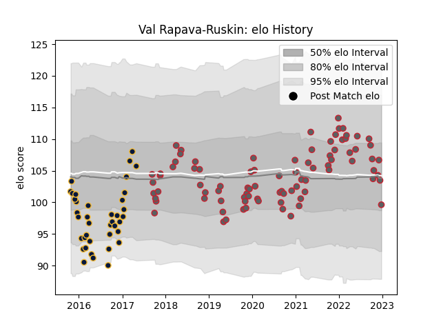

---  
layout: page  
title: Val Rapava-Ruskin  
date: 2023-02-02 18:53:11.013282  
categories: player  
---
# Val Rapava-Ruskin

## Positions: P

## Current elo: 92.0

## Current Percentile: 42.0

# Elo History

# Match History

| Team               |   Appearances |   Win Rate |
|:-------------------|--------------:|-----------:|
| Gloucester Rugby   |            90 |   0.488889 |
| Worcester Warriors |            39 |   0.333333 |

| Opponent            |   Matches |   Win Rate |
|:--------------------|----------:|-----------:|
| Bath Rugby          |        10 |   0.45     |
| London Irish        |        10 |   0.75     |
| Harlequins          |        10 |   0.2      |
| Leicester Tigers    |         9 |   0.111111 |
| Wasps               |         9 |   0.555556 |
| Saracens            |         9 |   0.222222 |
| Northampton Saints  |         9 |   0.666667 |
| Newcastle Falcons   |         9 |   0.666667 |
| Bristol Rugby       |         8 |   0.375    |
| Sale Sharks         |         8 |   0.4375   |
| Exeter Chiefs       |         8 |   0.125    |
| Worcester Warriors  |         6 |   0.833333 |
| Gloucester Rugby    |         6 |   0.25     |
| Bordeaux Begles     |         2 |   1        |
| Montpellier Herault |         2 |   0.5      |
| Connacht            |         2 |   1        |
| Cardiff Blues       |         2 |   0.5      |
| Stade Toulousain    |         2 |   0        |
| La Rochelle         |         1 |   0        |
| Munster             |         1 |   0        |
| Dragons             |         1 |   1        |
| Pau                 |         1 |   0        |
| RC Enisei           |         1 |   1        |
| Castres Olympique   |         1 |   1        |
| Brive               |         1 |   0        |
| Leinster            |         1 |   0        |