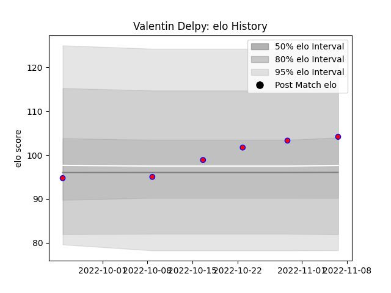

---  
layout: page  
title: Valentin Delpy  
date: 2023-01-15 11:44:13.854480  
categories: player  
---
# Valentin Delpy

## Positions: FH

## Current elo: 100.0

## Current Percentile: 71.0

# Elo History

# Match History

| Team    |   Appearances |   Win Rate |
|:--------|--------------:|-----------:|
| Blagnac |             9 |   0.555556 |

| Opponent                   |   Matches |   Win Rate |
|:---------------------------|----------:|-----------:|
| Albi                       |         1 |          0 |
| Carqueiranne-Hyères        |         1 |          1 |
| Chambery                   |         1 |          1 |
| Cognac Saint Jean d'Angély |         1 |          1 |
| Dax                        |         1 |          0 |
| Nice                       |         1 |          0 |
| Rennes                     |         1 |          1 |
| US Bressane                |         1 |          0 |
| Valence Romans Drome Rugby |         1 |          1 |