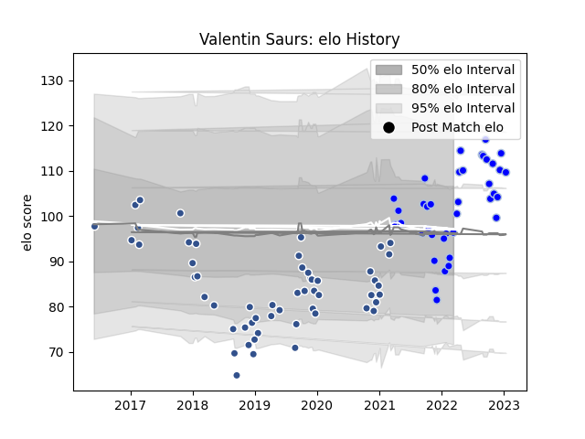

---  
layout: page  
title: Valentin Saurs  
date: 2023-01-17 11:31:44.187556  
categories: player  
---
# Valentin Saurs

## Positions: W, FB

## Current elo: 96.0

## Current Percentile: 37.0

# Elo History

# Match History

| Team      |   Appearances |   Win Rate |
|:----------|--------------:|-----------:|
| Agen      |            54 |   0.166667 |
| Colomiers |            38 |   0.605263 |

| Opponent             |   Matches |   Win Rate |
|:---------------------|----------:|-----------:|
| Stade Francais Paris |         5 |   0.2      |
| Grenoble             |         4 |   1        |
| Montpellier Herault  |         4 |   0.25     |
| Bordeaux Begles      |         4 |   0.25     |
| Aurillac             |         4 |   0.25     |
| Lyon                 |         4 |   0        |
| Rouen                |         3 |   0.666667 |
| Nevers               |         3 |   0.666667 |
| Narbonne             |         3 |   1        |
| Racing 92            |         3 |   0        |
| La Rochelle          |         3 |   0        |
| Oyonnax              |         3 |   0.666667 |
| Clermont Auvergne    |         3 |   0        |
| Castres Olympique    |         3 |   0.333333 |
| Carcassonne          |         3 |   0.333333 |
| Stade Toulousain     |         3 |   0        |
| Toulon               |         3 |   0        |
| Vannes               |         3 |   0.333333 |
| Pau                  |         2 |   0        |
| Soyaux-Angouleme     |         2 |   0.5      |
| Provence Rugby       |         2 |   0.5      |
| Perpignan            |         2 |   0.5      |
| Wasps                |         2 |   0        |
| Agen                 |         2 |   0.5      |
| Mont-de-Marsan       |         2 |   0.5      |
| Montauban            |         2 |   0.5      |
| Gloucester Rugby     |         2 |   0        |
| Brive                |         2 |   0.5      |
| Beziers              |         2 |   0.5      |
| Bayonne              |         2 |   0.5      |
| Massy                |         1 |   1        |
| London Irish         |         1 |   0        |
| Harlequins           |         1 |   0        |
| Bourgoin-Jallieu     |         1 |   1        |
| Biarritz Olympique   |         1 |   1        |
| US Bressane          |         1 |   0        |
| Zebre                |         1 |   0        |