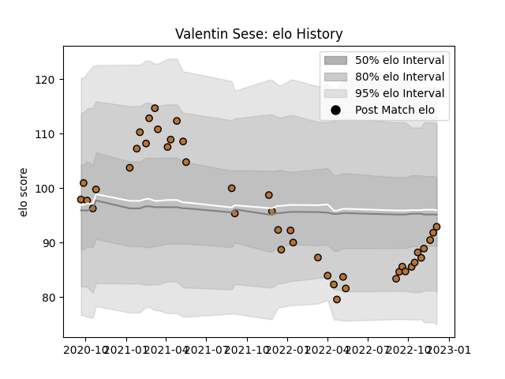

---  
layout: page  
title: Valentin Sese  
date: 2023-01-15 11:48:55.036777  
categories: player  
---
# Valentin Sese

## Positions: FL, L

## Current elo: 90.0

## Current Percentile: 39.0

# Elo History

# Match History

| Team     |   Appearances |   Win Rate |
|:---------|--------------:|-----------:|
| Narbonne |            54 |   0.435185 |

| Opponent                   |   Matches |   Win Rate |
|:---------------------------|----------:|-----------:|
| Tarbes                     |         3 |   0.666667 |
| Suresnes                   |         3 |   0.666667 |
| Blagnac                    |         3 |   0.833333 |
| Bourgoin-Jallieu           |         3 |   0.666667 |
| Nice                       |         3 |   1        |
| Cognac Saint Jean d'Angély |         3 |   1        |
| Grenoble                   |         2 |   0.25     |
| Albi                       |         2 |   0        |
| US Bressane                |         2 |   1        |
| Oyonnax                    |         2 |   0        |
| Nevers                     |         2 |   0        |
| Montauban                  |         2 |   0        |
| Mont-de-Marsan             |         2 |   0        |
| Vannes                     |         2 |   0.25     |
| Dijon                      |         2 |   0.5      |
| Chambery                   |         2 |   0        |
| Bayonne                    |         2 |   0        |
| Aurillac                   |         2 |   0        |
| Aubenas                    |         2 |   0.5      |
| Massy                      |         1 |   1        |
| Colomiers                  |         1 |   0        |
| Carqueiranne-Hyères        |         1 |   1        |
| Carcassonne                |         1 |   0        |
| Beziers                    |         1 |   0        |
| Provence Rugby             |         1 |   1        |
| Rennes                     |         1 |   1        |
| Rouen                      |         1 |   0        |
| Valence Romans Drome Rugby |         1 |   0        |
| Agen                       |         1 |   0        |