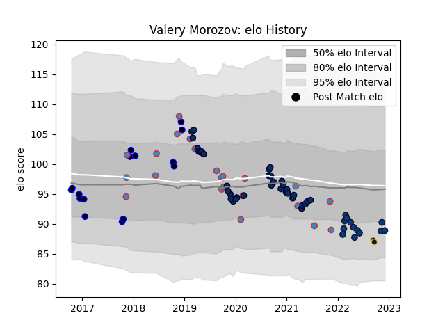

---  
layout: page  
title: Valery Morozov  
date: 2022-12-09 13:09:34.361958  
categories: player  
---
# Valery Morozov

## Positions: P

## Country: Russia

## Current elo: 89.0

## Current Percentile: 25.0

# Elo History

# Match History

| Team               |   Appearances |   Win Rate |
|:-------------------|--------------:|-----------:|
| Sale Sharks        |            35 |   0.642857 |
| Russia             |            22 |   0.409091 |
| RC Enisei          |            15 |   0.133333 |
| Bath Rugby         |            13 |   0.384615 |
| Worcester Warriors |             2 |   0        |

| Opponent                 |   Matches |   Win Rate |
|:-------------------------|----------:|-----------:|
| Worcester Warriors       |         7 |   0.428571 |
| Gloucester Rugby         |         5 |   0.8      |
| Bristol Rugby            |         5 |   0.7      |
| Wasps                    |         5 |   0.6      |
| Exeter Chiefs            |         5 |   0        |
| Bath Rugby               |         4 |   0.5      |
| Newcastle Falcons        |         4 |   0.5      |
| Leicester Tigers         |         4 |   0.75     |
| Harlequins               |         4 |   0.5      |
| La Rochelle              |         4 |   0.25     |
| Dragons                  |         4 |   0.25     |
| Northampton Saints       |         3 |   0.666667 |
| London Irish             |         3 |   0.666667 |
| Georgia                  |         2 |   0        |
| Bordeaux Begles          |         2 |   0        |
| Brive                    |         2 |   0        |
| Spain                    |         2 |   0        |
| Saracens                 |         2 |   0.5      |
| Romania                  |         2 |   1        |
| Portugal                 |         2 |   0.5      |
| Zebre                    |         2 |   0        |
| Japan                    |         2 |   0        |
| Netherlands              |         1 |   1        |
| Namibia                  |         1 |   1        |
| Chile                    |         1 |   1        |
| Belgium                  |         1 |   0        |
| Kenya                    |         1 |   1        |
| Samoa                    |         1 |   0        |
| Scotland                 |         1 |   0        |
| Italy                    |         1 |   0        |
| United States of America |         1 |   0        |
| Ireland                  |         1 |   0        |
| Hong Kong                |         1 |   1        |
| Canada                   |         1 |   1        |