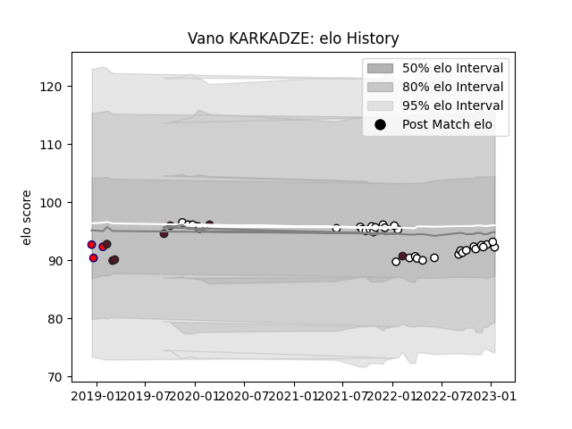

---  
layout: page  
title: Vano KARKADZE  
date: 2023-01-23 15:32:55.048945  
categories: player  
---
# Vano KARKADZE

## Positions: H

## Country: Georgia

## Current elo: 92.0

## Current Percentile: 43.0

# Elo History

# Match History

| Team     |   Appearances |   Win Rate |
|:---------|--------------:|-----------:|
| Brive    |            34 |   0.279412 |
| Georgia  |             7 |   0.785714 |
| Aurillac |             3 |   0.333333 |

| Opponent             |   Matches |   Win Rate |
|:---------------------|----------:|-----------:|
| Bayonne              |         3 |        0.5 |
| La Rochelle          |         3 |        0   |
| Stade Francais Paris |         3 |        1   |
| Lyon                 |         3 |        0   |
| Bordeaux Begles      |         3 |        0   |
| Pau                  |         2 |        0.5 |
| Racing 92            |         2 |        0   |
| Castres Olympique    |         2 |        0.5 |
| Toulon               |         2 |        0.5 |
| Connacht             |         2 |        0   |
| Belgium              |         2 |        1   |
| Montpellier Herault  |         2 |        0   |
| Perpignan            |         2 |        1   |
| Uruguay              |         1 |        1   |
| Stade Toulousain     |         1 |        0   |
| Biarritz Olympique   |         1 |        0   |
| Scotland             |         1 |        0   |
| Romania              |         1 |        1   |
| Bristol Rugby        |         1 |        0   |
| Portugal             |         1 |        0.5 |
| Carcassonne          |         1 |        0   |
| Germany              |         1 |        1   |
| Edinburgh            |         1 |        0   |
| Colomiers            |         1 |        1   |
| Clermont Auvergne    |         1 |        0   |
| Zebre                |         1 |        0   |