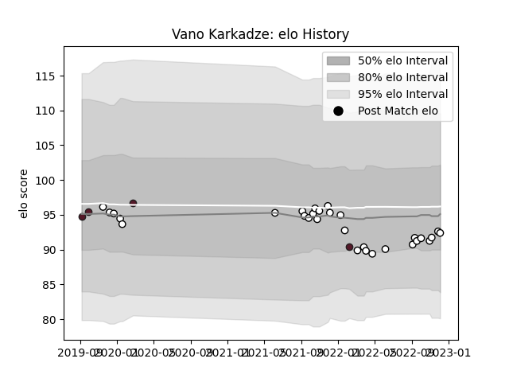

---  
layout: page  
title: Vano Karkadze  
date: 2022-12-12 14:54:54.799251  
categories: player  
---
# Vano Karkadze

## Positions: H

## Country: Georgia

## Current elo: 92.0

## Current Percentile: 38.0

# Elo History

# Match History

| Team    |   Appearances |   Win Rate |
|:--------|--------------:|-----------:|
| Brive   |            30 |      0.25  |
| Georgia |             4 |      0.625 |

| Opponent             |   Matches |   Win Rate |
|:---------------------|----------:|-----------:|
| La Rochelle          |         3 |       0    |
| Stade Francais Paris |         3 |       1    |
| Bordeaux Begles      |         3 |       0    |
| Lyon                 |         3 |       0    |
| Bayonne              |         2 |       0.75 |
| Racing 92            |         2 |       0    |
| Perpignan            |         2 |       1    |
| Montpellier Herault  |         2 |       0    |
| Castres Olympique    |         2 |       0.5  |
| Edinburgh            |         1 |       0    |
| Clermont Auvergne    |         1 |       0    |
| Belgium              |         1 |       1    |
| Pau                  |         1 |       0    |
| Portugal             |         1 |       0.5  |
| Bristol Rugby        |         1 |       0    |
| Scotland             |         1 |       0    |
| Biarritz Olympique   |         1 |       0    |
| Stade Toulousain     |         1 |       0    |
| Toulon               |         1 |       0    |
| Uruguay              |         1 |       1    |
| Zebre                |         1 |       0    |