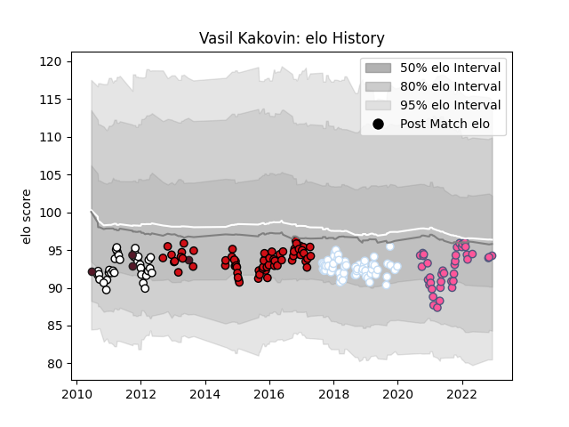

---  
layout: page  
title: Vasil Kakovin  
date: 2023-01-17 11:42:59.429466  
categories: player  
---
# Vasil Kakovin

## Positions: P

## Country: Georgia

## Current elo: 86.0

## Current Percentile: 15.0

# Elo History

# Match History

| Team                 |   Appearances |   Win Rate |
|:---------------------|--------------:|-----------:|
| Stade Toulousain     |            72 |   0.520833 |
| Racing 92            |            63 |   0.603175 |
| Stade Francais Paris |            43 |   0.476744 |
| Brive                |            35 |   0.357143 |
| Georgia              |             5 |   0.2      |

| Opponent             |   Matches |   Win Rate |
|:---------------------|----------:|-----------:|
| Castres Olympique    |        18 |   0.611111 |
| Clermont Auvergne    |        16 |   0.34375  |
| Montpellier Herault  |        16 |   0.25     |
| Bordeaux Begles      |        12 |   0.333333 |
| Stade Toulousain     |        12 |   0.333333 |
| La Rochelle          |        11 |   0.545455 |
| Toulon               |        11 |   0.545455 |
| Agen                 |        10 |   0.55     |
| Pau                  |        10 |   0.5      |
| Racing 92            |        10 |   0.4      |
| Stade Francais Paris |         9 |   0.777778 |
| Grenoble             |         9 |   0.666667 |
| Brive                |         9 |   0.722222 |
| Perpignan            |         8 |   0.625    |
| Lyon                 |         8 |   0.5      |
| Bayonne              |         8 |   0.375    |
| Oyonnax              |         7 |   0.857143 |
| Ulster               |         3 |   0.333333 |
| Benetton Treviso     |         3 |   0.666667 |
| Leicester Tigers     |         3 |   0.666667 |
| Munster              |         3 |   0.666667 |
| Connacht             |         2 |   0.5      |
| Glasgow Warriors     |         2 |   1        |
| Argentina            |         2 |   0        |
| Lions                |         2 |   0.5      |
| Sale Sharks          |         1 |   1        |
| Romania              |         1 |   1        |
| Saracens             |         1 |   0        |
| Wasps                |         1 |   0        |
| Leinster             |         1 |   0        |
| Ospreys              |         1 |   0        |
| Mont-de-Marsan       |         1 |   1        |
| Japan                |         1 |   0        |
| Italy A              |         1 |   0        |
| Bristol Rugby        |         1 |   0        |
| Bourgoin-Jallieu     |         1 |   1        |
| Biarritz Olympique   |         1 |   1        |
| Bath Rugby           |         1 |   0        |
| Zebre                |         1 |   1        |