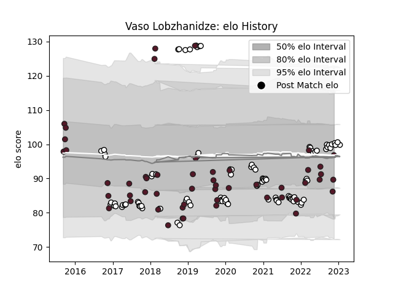

---  
layout: page  
title: Vaso Lobzhanidze  
date: 2023-03-06 11:25:24.909815  
categories: player  
---
# Vaso Lobzhanidze

## Positions: SH

## Country: Georgia

## Current elo: 90.0

## Current Percentile: 91.0

# Elo History

# Match History

| Team    |   Appearances |   Win Rate |
|:--------|--------------:|-----------:|
| Brive   |           104 |   0.471154 |
| Georgia |            62 |   0.653226 |

| Opponent                 |   Matches |   Win Rate |
|:-------------------------|----------:|-----------:|
| Stade Francais Paris     |         7 |   0.714286 |
| Romania                  |         7 |   0.857143 |
| Castres Olympique        |         7 |   0.571429 |
| Lyon                     |         7 |   0.285714 |
| Pau                      |         7 |   0.571429 |
| Bayonne                  |         6 |   0.583333 |
| Bordeaux Begles          |         6 |   0.166667 |
| Spain                    |         6 |   1        |
| Russia                   |         5 |   1        |
| Clermont Auvergne        |         5 |   0.2      |
| Montpellier Herault      |         5 |   0.3      |
| Stade Toulousain         |         5 |   0        |
| Germany                  |         4 |   1        |
| Toulon                   |         4 |   0.5      |
| Worcester Warriors       |         4 |   0.75     |
| Scotland                 |         4 |   0        |
| La Rochelle              |         3 |   0.333333 |
| Italy                    |         3 |   0.333333 |
| Argentina                |         3 |   0        |
| Perpignan                |         3 |   0.666667 |
| Racing 92                |         3 |   0        |
| Japan                    |         3 |   0        |
| Samoa                    |         3 |   0.666667 |
| Wales                    |         3 |   0.333333 |
| Biarritz Olympique       |         3 |   0.666667 |
| Grenoble                 |         2 |   0.5      |
| Fiji                     |         2 |   0.25     |
| Aurillac                 |         2 |   0.5      |
| RC Enisei                |         2 |   1        |
| Portugal                 |         2 |   1        |
| Uruguay                  |         2 |   1        |
| Oyonnax                  |         2 |   1        |
| Soyaux-Angouleme         |         2 |   1        |
| Bristol Rugby            |         2 |   0        |
| Canada                   |         2 |   1        |
| Netherlands              |         2 |   1        |
| United States of America |         2 |   1        |
| Dragons                  |         2 |   0.5      |
| Tonga                    |         2 |   1        |
| Enisey-STM Krasnoyarsk   |         2 |   1        |
| Namibia                  |         2 |   1        |
| US Bressane              |         1 |   1        |
| South Africa             |         1 |   0        |
| Vannes                   |         1 |   1        |
| Agen                     |         1 |   0        |
| Provence Rugby           |         1 |   0        |
| Newcastle Falcons        |         1 |   0        |
| New Zealand              |         1 |   0        |
| Nevers                   |         1 |   1        |
| Mont-de-Marsan           |         1 |   1        |
| Massy                    |         1 |   0        |
| France                   |         1 |   0        |
| Colomiers                |         1 |   0        |
| Carcassonne              |         1 |   1        |
| Beziers                  |         1 |   0        |
| Belgium                  |         1 |   1        |
| Bath Rugby               |         1 |   0        |
| Australia                |         1 |   0        |
| Zebre                    |         1 |   1        |