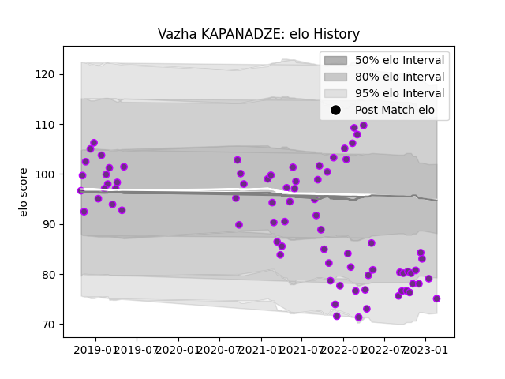

---  
layout: page  
title: Vazha KAPANADZE  
date: 2023-03-11 00:12:10.176391  
categories: player  
---
# Vazha KAPANADZE

## Positions: P

## Current elo: 88.0

## Current Percentile: 11.0

# Elo History

# Match History

| Team        |   Appearances |   Win Rate |
|:------------|--------------:|-----------:|
| US Bressane |            80 |    0.59375 |

| Opponent                   |   Matches |   Win Rate |
|:---------------------------|----------:|-----------:|
| Narbonne                   |         7 |   0.714286 |
| Aurillac                   |         4 |   0.5      |
| Bayonne                    |         4 |   0        |
| Mont-de-Marsan             |         4 |   0.25     |
| Chambery                   |         4 |   0.75     |
| Oyonnax                    |         3 |   0.333333 |
| Nevers                     |         3 |   0.333333 |
| Tarbes                     |         3 |   0.666667 |
| Beziers                    |         3 |   1        |
| Albi                       |         3 |   0.666667 |
| Dax                        |         3 |   0.333333 |
| Carcassonne                |         3 |   0        |
| Colomiers                  |         3 |   0.666667 |
| Agen                       |         2 |   1        |
| Nice                       |         2 |   0.5      |
| Rouen                      |         2 |   0.75     |
| Soyaux-Angouleme           |         2 |   0.5      |
| Suresnes                   |         2 |   1        |
| Montauban                  |         2 |   0.25     |
| Vannes                     |         2 |   0        |
| Massy                      |         2 |   1        |
| Grenoble                   |         2 |   0.5      |
| Cognac Saint Jean d'Angély |         2 |   1        |
| Carqueiranne-Hyères        |         2 |   0.5      |
| Bourgoin-Jallieu           |         2 |   1        |
| Blagnac                    |         2 |   1        |
| Brive                      |         1 |   1        |
| Provence Rugby             |         1 |   0.5      |
| Rennes                     |         1 |   1        |
| Biarritz Olympique         |         1 |   1        |
| Aubenas                    |         1 |   1        |
| Valence Romans Drome Rugby |         1 |   1        |
| Dijon                      |         1 |   1        |