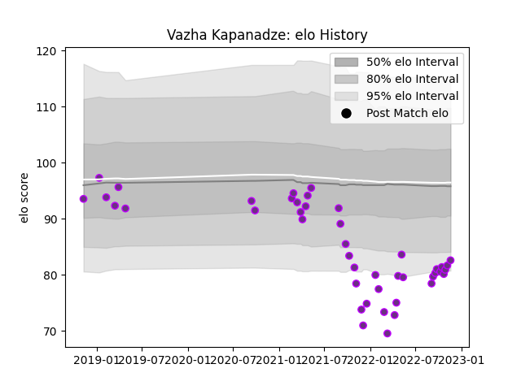

---  
layout: page  
title: Vazha Kapanadze  
date: 2022-11-22 11:36:10.921675  
categories: player  
---
# Vazha Kapanadze

## Positions: P

## Current elo: 83.0

## Current Percentile: 5.0

# Elo History

# Match History

| Team        |   Appearances |   Win Rate |
|:------------|--------------:|-----------:|
| US Bressane |            44 |   0.556818 |

| Opponent                   |   Matches |   Win Rate |
|:---------------------------|----------:|-----------:|
| Aurillac                   |         3 |   0.666667 |
| Bayonne                    |         3 |   0        |
| Nevers                     |         3 |   0.333333 |
| Mont-de-Marsan             |         3 |   0        |
| Dax                        |         2 |   0.5      |
| Grenoble                   |         2 |   0.5      |
| Suresnes                   |         2 |   1        |
| Nice                       |         2 |   0.5      |
| Montauban                  |         2 |   0.25     |
| Massy                      |         2 |   1        |
| Vannes                     |         2 |   0        |
| Cognac Saint Jean d'Angély |         2 |   1        |
| Chambery                   |         2 |   1        |
| Bourgoin-Jallieu           |         2 |   1        |
| Blagnac                    |         2 |   1        |
| Colomiers                  |         1 |   1        |
| Aubenas                    |         1 |   1        |
| Carqueiranne-Hyères        |         1 |   1        |
| Carcassonne                |         1 |   0        |
| Narbonne                   |         1 |   0        |
| Oyonnax                    |         1 |   0        |
| Rennes                     |         1 |   1        |
| Soyaux-Angouleme           |         1 |   0        |
| Beziers                    |         1 |   1        |
| Albi                       |         1 |   1        |