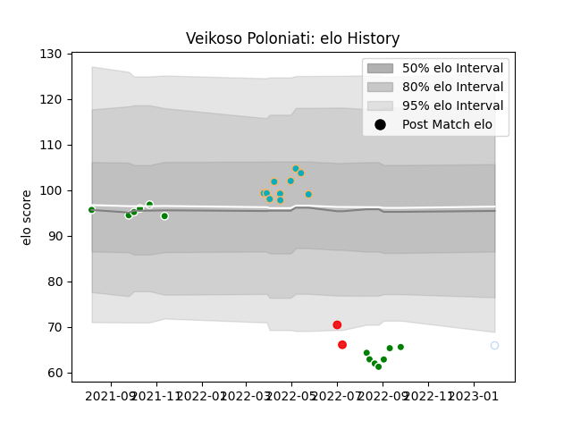

---  
layout: page  
title: Veikoso Poloniati  
date: 2023-02-02 19:10:52.087628  
categories: player  
---
# Veikoso Poloniati

## Positions: L

## Country: Tonga

## Current elo: 66.0

## Current Percentile: 4.0

# Elo History

# Match History

| Team           |   Appearances |   Win Rate |
|:---------------|--------------:|-----------:|
| Manawatu       |            13 |   0.307692 |
| Moana Pasifika |            10 |   0.1      |
| Tonga          |             2 |   0        |
| Racing 92      |             1 |   1        |

| Opponent                 |   Matches |   Win Rate |
|:-------------------------|----------:|-----------:|
| Otago                    |         3 |   0.333333 |
| Chiefs                   |         2 |   0        |
| Counties Manukau         |         2 |   0.5      |
| Blues                    |         2 |   0        |
| Auckland                 |         1 |   0        |
| North Harbour            |         1 |   0        |
| Waikato                  |         1 |   0        |
| Tasman                   |         1 |   0        |
| Taranaki                 |         1 |   0        |
| Southland                |         1 |   1        |
| Samoa                    |         1 |   0        |
| Northland                |         1 |   1        |
| Melbourne Rebels         |         1 |   0        |
| New South Wales Waratahs |         1 |   0        |
| La Rochelle              |         1 |   1        |
| Hurricanes               |         1 |   1        |
| Highlanders              |         1 |   0        |
| Hawke's Bay              |         1 |   0        |
| Fijian Drua              |         1 |   0        |
| Fiji                     |         1 |   0        |
| Western Force            |         1 |   0        |