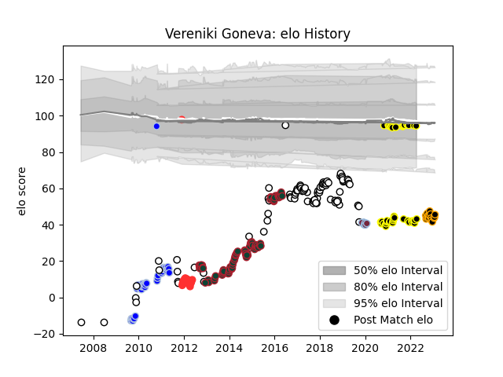

---  
layout: page  
title: Vereniki Goneva  
date: 2023-02-02 19:08:16.675434  
categories: player  
---
# Vereniki Goneva

## Positions: W, C

## Country: Fiji

## Current elo: 94.0

## Current Percentile: 0.0

# Elo History

# Match History

| Team              |   Appearances |   Win Rate |
|:------------------|--------------:|-----------:|
| Leicester Tigers  |            87 |   0.683908 |
| Newcastle Falcons |            56 |   0.464286 |
| Colomiers         |            46 |   0.282609 |
| Mont-de-Marsan    |            43 |   0.662791 |
| Fiji              |            35 |   0.328571 |
| Tarbes            |            19 |   0.421053 |
| Chambery          |            16 |   0.4375   |
| Harlequins        |             8 |   0.4375   |

| Opponent                   |   Matches |   Win Rate |
|:---------------------------|----------:|-----------:|
| Northampton Saints         |        14 |   0.75     |
| Exeter Chiefs              |        13 |   0.538462 |
| Sale Sharks                |        13 |   0.692308 |
| Saracens                   |        12 |   0.208333 |
| Harlequins                 |        11 |   0.545455 |
| Bath Rugby                 |        10 |   0.55     |
| Gloucester Rugby           |         9 |   0.666667 |
| Wasps                      |         9 |   0.666667 |
| Narbonne                   |         8 |   0.625    |
| Grenoble                   |         8 |   0.125    |
| Worcester Warriors         |         8 |   0.75     |
| Aurillac                   |         8 |   0.375    |
| Provence Rugby             |         7 |   0.642857 |
| Leicester Tigers           |         7 |   0.214286 |
| London Irish               |         7 |   0.857143 |
| Ulster                     |         6 |   0.166667 |
| Dax                        |         6 |   0.5      |
| Tarbes                     |         5 |   0.5      |
| Auch                       |         5 |   0.2      |
| Albi                       |         5 |   0.2      |
| Newcastle Falcons          |         5 |   1        |
| Carcassonne                |         5 |   0.6      |
| Oyonnax                    |         5 |   0.5      |
| Wales                      |         4 |   0.125    |
| Mont-de-Marsan             |         4 |   0.125    |
| US Bressane                |         4 |   0.75     |
| La Rochelle                |         4 |   0.5      |
| Pau                        |         4 |   0        |
| Montpellier Herault        |         4 |   0.75     |
| Australia                  |         4 |   0        |
| Beziers                    |         4 |   0.75     |
| Benetton Treviso           |         4 |   1        |
| Agen                       |         3 |   0.666667 |
| Lyon                       |         3 |   0.5      |
| Bordeaux Begles            |         3 |   0        |
| Scotland                   |         3 |   0        |
| Ireland                    |         3 |   0        |
| Montauban                  |         3 |   0.333333 |
| Toulon                     |         3 |   0.333333 |
| Scarlets                   |         3 |   0.333333 |
| Uruguay                    |         3 |   0.666667 |
| Italy                      |         3 |   0.333333 |
| Vannes                     |         3 |   0.333333 |
| Bayonne                    |         2 |   1        |
| Rouen                      |         2 |   1        |
| Soyaux-Angouleme           |         2 |   0.5      |
| Périgueux                  |         2 |   1        |
| Bourgoin-Jallieu           |         2 |   0.5      |
| Stade Francais Paris       |         2 |   1        |
| Bristol Rugby              |         2 |   0.5      |
| Canada                     |         2 |   1        |
| Biarritz Olympique         |         2 |   0.75     |
| Tonga                      |         2 |   0.5      |
| Nevers                     |         2 |   0        |
| Cognac Saint Jean d'Angély |         2 |   1        |
| England                    |         2 |   0        |
| Munster                    |         2 |   1        |
| Valence Romans Drome Rugby |         2 |   0.75     |
| Stade Toulousain           |         1 |   0        |
| Suresnes                   |         1 |   0        |
| Blagnac                    |         1 |   0        |
| South Africa               |         1 |   0        |
| United States of America   |         1 |   1        |
| Georgia                    |         1 |   0        |
| Samoa                      |         1 |   0        |
| Namibia                    |         1 |   1        |
| Japan                      |         1 |   1        |
| France                     |         1 |   1        |
| Lannemezan                 |         1 |   0        |
| Edinburgh                  |         1 |   0        |
| London Welsh               |         1 |   1        |
| Dragons                    |         1 |   1        |
| Colomiers                  |         1 |   0        |
| New Zealand Maori          |         1 |   0        |
| Saint-Etienne              |         1 |   1        |
| Clermont Auvergne          |         1 |   0        |
| Nice                       |         1 |   1        |
| Carqueiranne-Hyères        |         1 |   0        |
| Ospreys                    |         1 |   1        |
| Perpignan                  |         1 |   0        |
| Rennes                     |         1 |   1        |
| Romania                    |         1 |   1        |
| Racing 92                  |         1 |   0        |