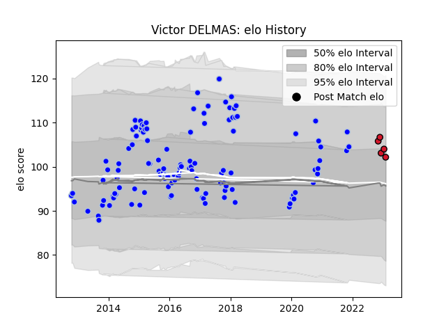

---  
layout: page  
title: Victor DELMAS  
date: 2023-03-02 11:25:02.386358  
categories: player  
---
# Victor DELMAS

## Positions: P

## Current elo: 105.0

## Current Percentile: None

# Elo History

# Match History

| Team      |   Appearances |   Win Rate |
|:----------|--------------:|-----------:|
| Colomiers |           120 |   0.541667 |
| Oyonnax   |             8 |   0.875    |

| Opponent           |   Matches |   Win Rate |
|:-------------------|----------:|-----------:|
| Montauban          |        11 |   0.636364 |
| Aurillac           |        10 |   0.7      |
| Narbonne           |        10 |   0.8      |
| Dax                |         9 |   0.777778 |
| Beziers            |         8 |   0.25     |
| Mont-de-Marsan     |         8 |   0.3125   |
| Carcassonne        |         7 |   0.428571 |
| Biarritz Olympique |         6 |   0.5      |
| Pau                |         5 |   0.2      |
| Nevers             |         5 |   0.6      |
| Bourgoin-Jallieu   |         5 |   0.6      |
| Lyon               |         5 |   0.2      |
| Soyaux-Angouleme   |         4 |   0.75     |
| Albi               |         4 |   0.5      |
| Rouen              |         4 |   0.75     |
| Tarbes             |         4 |   0.25     |
| Bayonne            |         3 |   0.5      |
| Oyonnax            |         3 |   0.833333 |
| Perpignan          |         3 |   0.5      |
| Vannes             |         3 |   0.666667 |
| Grenoble           |         2 |   1        |
| Provence Rugby     |         2 |   1        |
| Roval Drome XV     |         1 |   1        |
| US Bressane        |         1 |   1        |
| Agen               |         1 |   0        |
| La Rochelle        |         1 |   0        |
| Brive              |         1 |   0        |
| Auch               |         1 |   1        |
| Massy              |         1 |   1        |