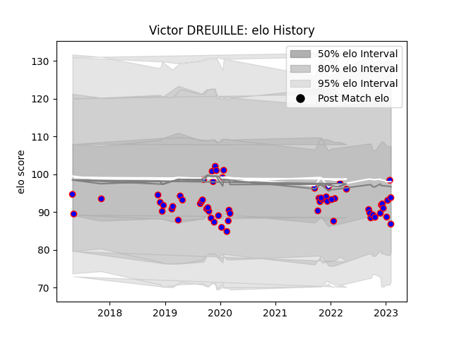

---  
layout: page  
title: Victor DREUILLE  
date: 2023-01-31 16:07:09.049276  
categories: player  
---
# Victor DREUILLE

## Positions: FH, C

## Current elo: 94.0

## Current Percentile: 26.0

# Elo History

# Match History

| Team    |   Appearances |   Win Rate |
|:--------|--------------:|-----------:|
| Beziers |            59 |   0.483051 |

| Opponent           |   Matches |   Win Rate |
|:-------------------|----------:|-----------:|
| Colomiers          |         6 |   0.333333 |
| Nevers             |         5 |   0.3      |
| Oyonnax            |         5 |   0.2      |
| Vannes             |         4 |   0.5      |
| Mont-de-Marsan     |         4 |   0.25     |
| Montauban          |         4 |   0.75     |
| Aurillac           |         4 |   0.75     |
| Provence Rugby     |         3 |   0.666667 |
| Bayonne            |         3 |   0.333333 |
| Soyaux-Angouleme   |         3 |   0.333333 |
| Grenoble           |         3 |   0.333333 |
| Rouen              |         3 |   1        |
| Roval Drome XV     |         2 |   1        |
| Agen               |         2 |   1        |
| Perpignan          |         2 |   0        |
| Carcassonne        |         2 |   0        |
| Biarritz Olympique |         2 |   0.5      |
| US Bressane        |         1 |   1        |
| Narbonne           |         1 |   1        |