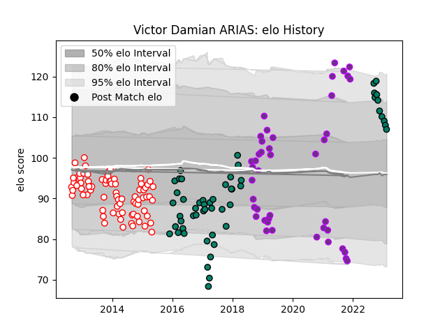

---  
layout: page  
title: Victor Damian ARIAS  
date: 2023-03-16 11:31:23.323514  
categories: player  
---
# Victor Damian ARIAS

## Positions: P

## Current elo: 100.0

## Current Percentile: 83.0

# Elo History

# Match History

| Team        |   Appearances |   Win Rate |
|:------------|--------------:|-----------:|
| Dax         |            80 |   0.35625  |
| Montauban   |            43 |   0.523256 |
| US Bressane |            43 |   0.511628 |
| Suresnes    |            14 |   0.214286 |

| Opponent                   |   Matches |   Win Rate |
|:---------------------------|----------:|-----------:|
| Carcassonne                |        13 |   0.384615 |
| Aurillac                   |        11 |   0.318182 |
| Narbonne                   |        11 |   0.272727 |
| Beziers                    |        11 |   0.545455 |
| Albi                       |        10 |   0.4      |
| Colomiers                  |         9 |   0.333333 |
| Tarbes                     |         9 |   0.444444 |
| Bourgoin-Jallieu           |         9 |   0.333333 |
| Mont-de-Marsan             |         8 |   0.375    |
| Biarritz Olympique         |         7 |   0.428571 |
| Agen                       |         6 |   0.333333 |
| Massy                      |         6 |   0.666667 |
| Vannes                     |         6 |   0.583333 |
| Dax                        |         5 |   0.6      |
| Montauban                  |         4 |   0.25     |
| Soyaux-Angouleme           |         4 |   1        |
| Perpignan                  |         4 |   0.5      |
| Pau                        |         4 |   0.25     |
| Oyonnax                    |         4 |   0.5      |
| Lyon                       |         4 |   0        |
| La Rochelle                |         4 |   0.25     |
| Brive                      |         4 |   0.5      |
| Provence Rugby             |         3 |   0.333333 |
| Bayonne                    |         3 |   0.333333 |
| Nevers                     |         3 |   0.333333 |
| US Bressane                |         3 |   0.333333 |
| Auch                       |         3 |   0.833333 |
| Nice                       |         2 |   0        |
| Valence Romans Drome Rugby |         2 |   0        |
| Carqueiranne-Hyères        |         2 |   0.5      |
| Suresnes                   |         1 |   1        |
| Blagnac                    |         1 |   1        |
| Rouen                      |         1 |   0.5      |
| Rennes                     |         1 |   1        |
| Cognac Saint Jean d'Angély |         1 |   1        |
| Chambery                   |         1 |   1        |