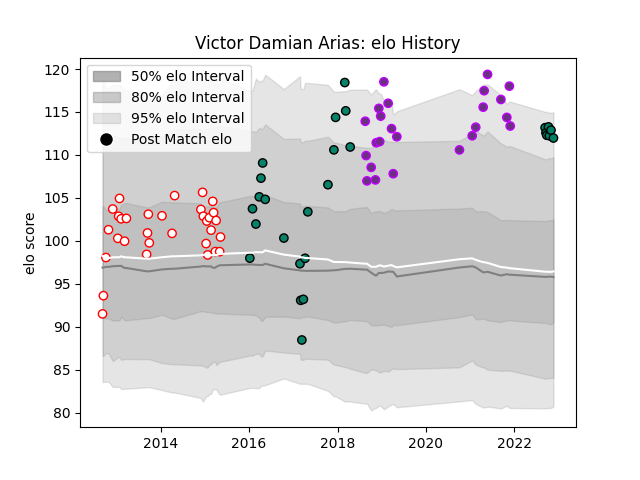

---  
layout: page  
title: Victor Damian Arias  
date: 2022-11-22 11:37:12.328945  
categories: player  
---
# Victor Damian Arias

## Positions: P

## Current elo: 112.0

## Current Percentile: 93.0

# Elo History

# Match History

| Team        |   Appearances |   Win Rate |
|:------------|--------------:|-----------:|
| Dax         |            32 |   0.265625 |
| US Bressane |            24 |   0.541667 |
| Montauban   |            20 |   0.4      |
| Suresnes    |             7 |   0.285714 |

| Opponent                   |   Matches |   Win Rate |
|:---------------------------|----------:|-----------:|
| Beziers                    |         9 |   0.666667 |
| Vannes                     |         5 |   0.5      |
| Tarbes                     |         5 |   0.4      |
| Narbonne                   |         5 |   0.2      |
| Colomiers                  |         5 |   0.2      |
| Carcassonne                |         4 |   0.25     |
| Mont-de-Marsan             |         4 |   0.5      |
| Bourgoin-Jallieu           |         4 |   0.375    |
| Soyaux-Angouleme           |         3 |   1        |
| Agen                       |         3 |   0        |
| Massy                      |         3 |   1        |
| Aurillac                   |         3 |   0        |
| Biarritz Olympique         |         3 |   0.333333 |
| Provence Rugby             |         2 |   0.5      |
| Brive                      |         2 |   0        |
| Dax                        |         2 |   0.5      |
| La Rochelle                |         2 |   0        |
| US Bressane                |         2 |   0        |
| Nevers                     |         2 |   0        |
| Oyonnax                    |         2 |   0.5      |
| Pau                        |         2 |   0        |
| Valence Romans Drome Rugby |         1 |   0        |
| Bayonne                    |         1 |   0        |
| Rouen                      |         1 |   0.5      |
| Carqueiranne-Hyères        |         1 |   1        |
| Perpignan                  |         1 |   0        |
| Cognac Saint Jean d'Angély |         1 |   1        |
| Montauban                  |         1 |   0        |
| Blagnac                    |         1 |   1        |
| Albi                       |         1 |   1        |
| Lyon                       |         1 |   0        |
| Nice                       |         1 |   0        |