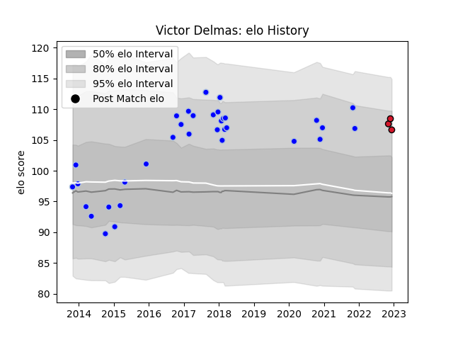

---  
layout: page  
title: Victor Delmas  
date: 2022-12-14 11:20:39.768654  
categories: player  
---
# Victor Delmas

## Positions: P

## Current elo: 107.0

## Current Percentile: None

# Elo History

# Match History

| Team      |   Appearances |   Win Rate |
|:----------|--------------:|-----------:|
| Colomiers |            34 |   0.470588 |
| Oyonnax   |             3 |   1        |

| Opponent           |   Matches |   Win Rate |
|:-------------------|----------:|-----------:|
| Aurillac           |         4 |   0.75     |
| Narbonne           |         4 |   1        |
| Montauban          |         3 |   0.333333 |
| Biarritz Olympique |         3 |   0.666667 |
| Oyonnax            |         2 |   0.75     |
| Tarbes             |         2 |   0        |
| Soyaux-Angouleme   |         2 |   0.5      |
| Grenoble           |         2 |   1        |
| Perpignan          |         2 |   0.25     |
| Mont-de-Marsan     |         2 |   0        |
| Pau                |         2 |   0        |
| Rouen              |         1 |   1        |
| Agen               |         1 |   0        |
| Nevers             |         1 |   0        |
| Albi               |         1 |   1        |
| Massy              |         1 |   1        |
| Dax                |         1 |   1        |
| Carcassonne        |         1 |   0        |
| Beziers            |         1 |   0        |
| Vannes             |         1 |   0        |