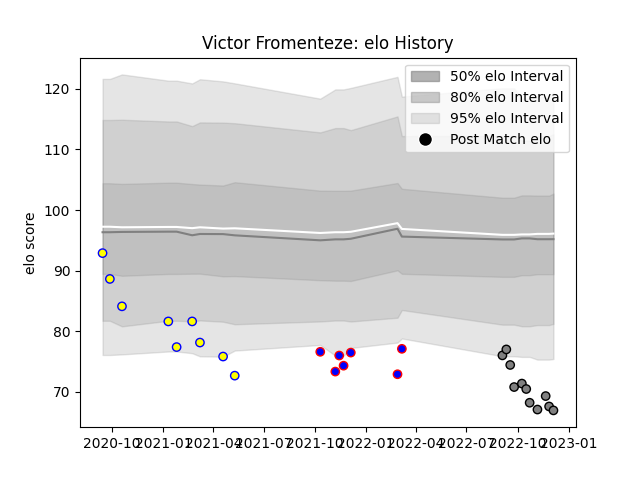

---  
layout: page  
title: Victor Fromenteze  
date: 2023-01-17 11:37:45.940595  
categories: player  
---
# Victor Fromenteze

## Positions: L

## Current elo: 94.0

## Current Percentile: 46.0

# Elo History

# Match History

| Team    |   Appearances |   Win Rate |
|:--------|--------------:|-----------:|
| Dijon   |            18 |   0.277778 |
| Aubenas |            17 |   0.323529 |
| Rennes  |            13 |   0.153846 |

| Opponent                   |   Matches |   Win Rate |
|:---------------------------|----------:|-----------:|
| Albi                       |         6 |   0        |
| Chambery                   |         5 |   0.2      |
| Massy                      |         4 |   0        |
| Tarbes                     |         4 |   0.125    |
| Suresnes                   |         4 |   0.25     |
| Nice                       |         4 |   0.25     |
| Cognac Saint Jean d'Angély |         3 |   0.333333 |
| Dax                        |         3 |   0.333333 |
| Narbonne                   |         3 |   0.333333 |
| Valence Romans Drome Rugby |         2 |   0.5      |
| Aubenas                    |         2 |   0.75     |
| Bourgoin-Jallieu           |         2 |   0.5      |
| Blagnac                    |         2 |   0.5      |
| Carqueiranne-Hyères        |         1 |   1        |
| Soyaux-Angouleme           |         1 |   0        |
| US Bressane                |         1 |   0        |
| Dijon                      |         1 |   0.5      |