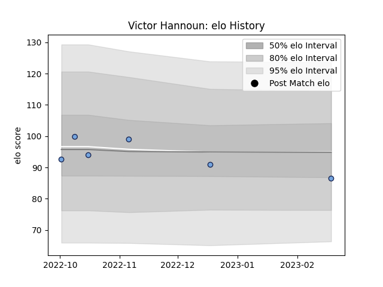

---  
layout: page  
title: Victor Hannoun  
date: 2023-02-24 02:33:51.847136  
categories: player  
---
# Victor Hannoun

## Positions: W

## Current elo: 86.0

## Current Percentile: 38.0

# Elo History

# Match History

| Team    |   Appearances |   Win Rate |
|:--------|--------------:|-----------:|
| Bayonne |             6 |        0.5 |

| Opponent             |   Matches |   Win Rate |
|:---------------------|----------:|-----------:|
| Benetton Treviso     |         1 |          0 |
| Brive                |         1 |          0 |
| Castres Olympique    |         1 |          0 |
| Clermont Auvergne    |         1 |          1 |
| La Rochelle          |         1 |          1 |
| Stade Francais Paris |         1 |          1 |