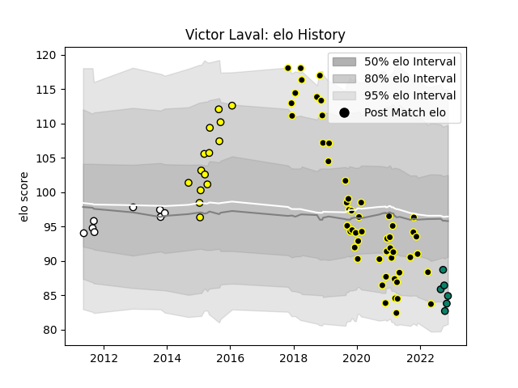

---  
layout: page  
title: Victor Laval  
date: 2022-11-22 11:43:50.631751  
categories: player  
---
# Victor Laval

## Positions: P

## Current elo: 85.0

## Current Percentile: 7.0

# Elo History

# Match History

| Team           |   Appearances |   Win Rate |
|:---------------|--------------:|-----------:|
| Mont-de-Marsan |            53 |   0.556604 |
| Carcassonne    |            14 |   0.428571 |
| Brive          |             8 |   0.4375   |
| Montauban      |             6 |   0.666667 |

| Opponent                   |   Matches |   Win Rate |
|:---------------------------|----------:|-----------:|
| Perpignan                  |         8 |   0.375    |
| Aurillac                   |         6 |   0.5      |
| Colomiers                  |         6 |   0.833333 |
| Biarritz Olympique         |         5 |   0.3      |
| Soyaux-Angouleme           |         5 |   0.2      |
| Rouen                      |         4 |   1        |
| Provence Rugby             |         4 |   0.75     |
| Vannes                     |         3 |   0        |
| Bayonne                    |         3 |   0.333333 |
| Carcassonne                |         3 |   1        |
| Grenoble                   |         3 |   0.666667 |
| Oyonnax                    |         3 |   0.166667 |
| Nevers                     |         3 |   0.666667 |
| Montauban                  |         2 |   0        |
| Valence Romans Drome Rugby |         2 |   0.75     |
| Tarbes                     |         2 |   0.5      |
| Agen                       |         2 |   0        |
| Mont-de-Marsan             |         2 |   0.5      |
| Dax                        |         2 |   1        |
| Beziers                    |         2 |   0.5      |
| Albi                       |         1 |   1        |
| Newcastle Falcons          |         1 |   1        |
| Lyon                       |         1 |   0        |
| Pau                        |         1 |   1        |
| Calvisano                  |         1 |   0.5      |
| Bucuresti                  |         1 |   1        |
| Roval Drome XV             |         1 |   0        |
| Brive                      |         1 |   1        |
| Bourgoin-Jallieu           |         1 |   1        |
| US Bressane                |         1 |   0        |
| Massy                      |         1 |   1        |