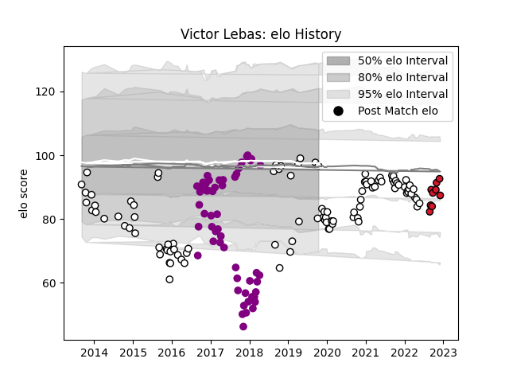

---  
layout: page  
title: Victor Lebas  
date: 2023-01-27 11:08:08.018411  
categories: player  
---
# Victor Lebas

## Positions: L

## Current elo: 101.0

## Current Percentile: 12.0

# Elo History

# Match History

| Team             |   Appearances |   Win Rate |
|:-----------------|--------------:|-----------:|
| Brive            |            98 |   0.438776 |
| Soyaux-Angouleme |            54 |   0.481481 |
| Oyonnax          |            10 |   0.7      |

| Opponent             |   Matches |   Win Rate |
|:---------------------|----------:|-----------:|
| Biarritz Olympique   |         8 |   0.4375   |
| Beziers              |         7 |   0.714286 |
| Agen                 |         6 |   0.333333 |
| Aurillac             |         6 |   0.5      |
| Stade Francais Paris |         6 |   0.666667 |
| Montpellier Herault  |         6 |   0.25     |
| Lyon                 |         5 |   0.4      |
| Toulon               |         5 |   0        |
| Stade Toulousain     |         5 |   0.2      |
| Perpignan            |         5 |   0.4      |
| Pau                  |         5 |   0.8      |
| Oyonnax              |         5 |   0.4      |
| Montauban            |         5 |   0.4      |
| Mont-de-Marsan       |         5 |   0.4      |
| Massy                |         5 |   0.6      |
| La Rochelle          |         5 |   0.2      |
| Bayonne              |         5 |   0.5      |
| Carcassonne          |         5 |   0.8      |
| Newcastle Falcons    |         4 |   0.75     |
| Vannes               |         4 |   0.5      |
| Grenoble             |         4 |   0.5      |
| Colomiers            |         4 |   0.5      |
| Clermont Auvergne    |         4 |   0.25     |
| Racing 92            |         4 |   0.25     |
| Nevers               |         3 |   0.666667 |
| Bordeaux Begles      |         3 |   0.333333 |
| Soyaux-Angouleme     |         3 |   1        |
| Zebre                |         3 |   0.333333 |
| Narbonne             |         3 |   0.666667 |
| Castres Olympique    |         3 |   0.666667 |
| Dax                  |         2 |   0.5      |
| Bucuresti            |         2 |   1        |
| Bristol Rugby        |         2 |   0        |
| Bourgoin-Jallieu     |         2 |   1        |
| RC Enisei            |         2 |   0.5      |
| Calvisano            |         2 |   0.75     |
| Albi                 |         2 |   0.5      |
| Gloucester Rugby     |         2 |   0        |
| Connacht             |         2 |   0.5      |
| Saracens             |         1 |   0        |
| Bath Rugby           |         1 |   0        |
| Edinburgh            |         1 |   0        |