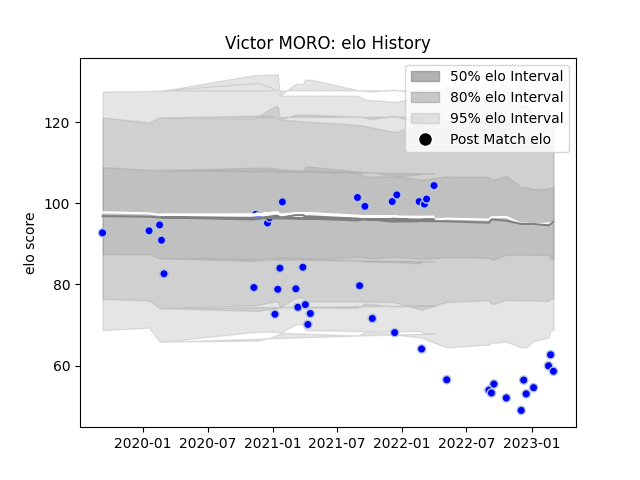

---  
layout: page  
title: Victor MORO  
date: 2023-03-02 11:23:13.196907  
categories: player  
---
# Victor MORO

## Positions: W, C

## Current elo: 66.0

## Current Percentile: 3.0

# Elo History

# Match History

| Team      |   Appearances |   Win Rate |
|:----------|--------------:|-----------:|
| Colomiers |            43 |   0.523256 |

| Opponent                   |   Matches |   Win Rate |
|:---------------------------|----------:|-----------:|
| Oyonnax                    |         5 |   0.7      |
| Carcassonne                |         4 |   0.5      |
| Agen                       |         3 |   0.666667 |
| Nevers                     |         3 |   0.666667 |
| Rouen                      |         3 |   0.666667 |
| Provence Rugby             |         3 |   1        |
| Grenoble                   |         3 |   0.333333 |
| Perpignan                  |         3 |   0.333333 |
| US Bressane                |         2 |   0.5      |
| Montauban                  |         2 |   0.5      |
| Mont-de-Marsan             |         2 |   0        |
| Biarritz Olympique         |         2 |   0        |
| Beziers                    |         2 |   1        |
| Vannes                     |         2 |   0        |
| Aurillac                   |         1 |   0        |
| Massy                      |         1 |   1        |
| Bayonne                    |         1 |   0        |
| Valence Romans Drome Rugby |         1 |   1        |