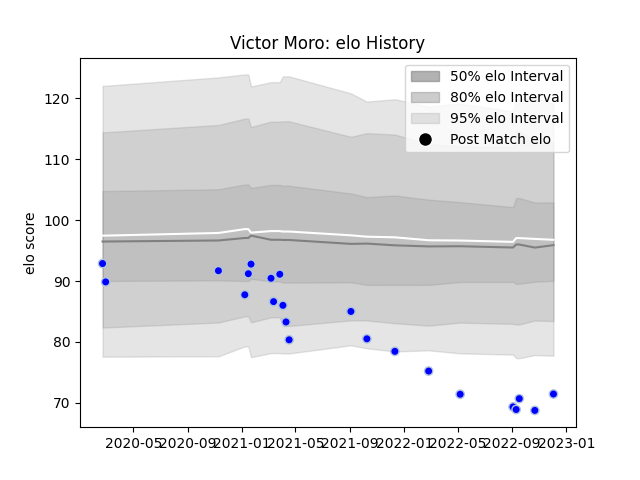

---  
layout: page  
title: Victor Moro  
date: 2022-12-18 16:23:15.448711  
categories: player  
---
# Victor Moro

## Positions: W, C

## Current elo: 73.0

## Current Percentile: 2.0

# Elo History

# Match History

| Team      |   Appearances |   Win Rate |
|:----------|--------------:|-----------:|
| Colomiers |            24 |   0.458333 |

| Opponent                   |   Matches |   Win Rate |
|:---------------------------|----------:|-----------:|
| Oyonnax                    |         4 |       0.75 |
| Vannes                     |         2 |       0    |
| US Bressane                |         2 |       0.5  |
| Carcassonne                |         2 |       0.5  |
| Provence Rugby             |         2 |       1    |
| Nevers                     |         1 |       0    |
| Valence Romans Drome Rugby |         1 |       1    |
| Rouen                      |         1 |       0    |
| Perpignan                  |         1 |       0    |
| Agen                       |         1 |       1    |
| Aurillac                   |         1 |       0    |
| Mont-de-Marsan             |         1 |       0    |
| Massy                      |         1 |       1    |
| Grenoble                   |         1 |       0    |
| Biarritz Olympique         |         1 |       0    |
| Bayonne                    |         1 |       0    |
| Montauban                  |         1 |       1    |