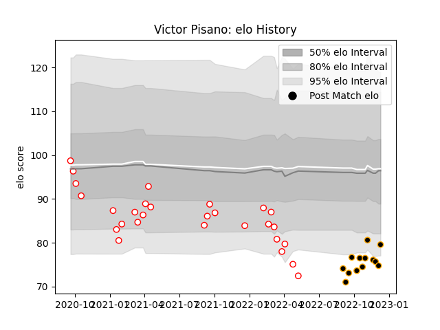

---  
layout: page  
title: Victor Pisano  
date: 2023-03-17 17:43:16.193384  
categories: player  
---
# Victor Pisano

## Positions: C, FB

## Current elo: 96.0

## Current Percentile: 15.0

# Elo History

# Match History

| Team     |   Appearances |   Win Rate |
|:---------|--------------:|-----------:|
| Dax      |            33 |   0.515152 |
| Chambery |            20 |   0.45     |

| Opponent                   |   Matches |   Win Rate |
|:---------------------------|----------:|-----------:|
| Blagnac                    |         6 |   0.333333 |
| Bourgoin-Jallieu           |         4 |   0.5      |
| Tarbes                     |         4 |   0.75     |
| Chambery                   |         4 |   0.75     |
| Cognac Saint Jean d'Angély |         4 |   0.5      |
| Albi                       |         3 |   0        |
| Narbonne                   |         3 |   0.666667 |
| Suresnes                   |         3 |   0.333333 |
| Nice                       |         3 |   1        |
| Valence Romans Drome Rugby |         3 |   0.666667 |
| Dijon                      |         3 |   0.666667 |
| Aubenas                    |         2 |   0.5      |
| Rennes                     |         2 |   0.5      |
| Dax                        |         2 |   0        |
| Carqueiranne-Hyères        |         2 |   0.5      |
| US Bressane                |         2 |   0        |
| Massy                      |         2 |   0        |
| Soyaux-Angouleme           |         1 |   1        |