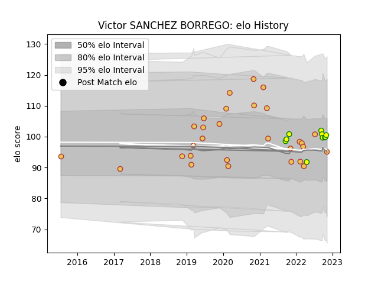

---  
layout: page  
title: Victor SANCHEZ BORREGO  
date: 2023-03-11 00:15:08.864924  
categories: player  
---
# Victor SANCHEZ BORREGO

## Positions: L, FL

## Country: Spain

## Current elo: 95.0

## Current Percentile: 62.0

# Elo History

# Match History

| Team                     |   Appearances |   Win Rate |
|:-------------------------|--------------:|-----------:|
| Spain                    |            29 |    0.62069 |
| Castilla y Leon Iberians |            10 |    0.6     |

| Opponent        |   Matches |   Win Rate |
|:----------------|----------:|-----------:|
| Georgia         |         5 |   0        |
| Russia          |         4 |   1        |
| Lusitanos XV    |         4 |   0.25     |
| Uruguay         |         3 |   0.666667 |
| Brussels Devils |         3 |   1        |
| Portugal        |         3 |   0.666667 |
| Romania         |         2 |   0.5      |
| Belgium         |         2 |   1        |
| Delta           |         2 |   1        |
| Fiji            |         1 |   0        |
| Germany         |         1 |   1        |
| Black Lion      |         1 |   0        |
| Kenya           |         1 |   0        |
| Namibia         |         1 |   1        |
| Netherlands     |         1 |   1        |
| Chile           |         1 |   1        |
| Canada          |         1 |   1        |
| Brazil          |         1 |   1        |
| Tonga           |         1 |   0        |
| Hong Kong       |         1 |   1        |