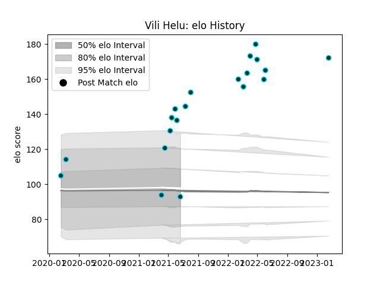

---  
layout: page  
title: Vili Helu  
date: 2023-02-24 02:25:11.793536  
categories: player  
---
# Vili Helu

## Positions: FL

## Current elo: 93.0

## Current Percentile: 97.0

# Elo History

# Match History

| Team      |   Appearances |   Win Rate |
|:----------|--------------:|-----------:|
| Rugby ATL |            20 |        0.8 |

| Opponent               |   Matches |   Win Rate |
|:-----------------------|----------:|-----------:|
| NOLA Gold              |         4 |   1        |
| Toronto Arrows         |         4 |   1        |
| L. A. Giltinis         |         3 |   0.333333 |
| Houston SaberCats      |         2 |   1        |
| Old Glory DC           |         2 |   0.5      |
| San Diego Legion       |         2 |   1        |
| Austin Gilgronis       |         1 |   0        |
| New England Free Jacks |         1 |   1        |
| Utah Warriors          |         1 |   1        |