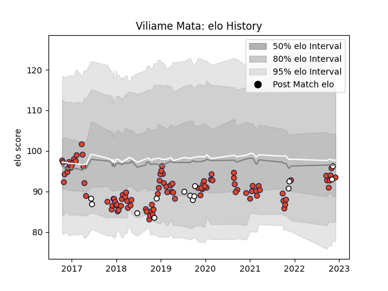

---  
layout: page  
title: Viliame Mata  
date: 2022-12-18 16:13:48.298722  
categories: player  
---
# Viliame Mata

## Positions: N8, FL

## Country: Fiji

## Current elo: 94.0

## Current Percentile: 46.0

# Elo History

# Match History

| Team      |   Appearances |   Win Rate |
|:----------|--------------:|-----------:|
| Edinburgh |           100 |   0.57     |
| Fiji      |            14 |   0.392857 |

| Opponent             |   Matches |   Win Rate |
|:---------------------|----------:|-----------:|
| Glasgow Warriors     |        14 |   0.571429 |
| Ulster               |         8 |   0.25     |
| Munster              |         7 |   0.285714 |
| Zebre                |         6 |   0.666667 |
| Scarlets             |         6 |   0.666667 |
| Benetton Treviso     |         6 |   0.5      |
| Dragons              |         5 |   0.8      |
| Cardiff Blues        |         5 |   0.4      |
| Connacht             |         4 |   0.75     |
| Stade Francais Paris |         4 |   0.5      |
| Southern Kings       |         4 |   0.75     |
| Bordeaux Begles      |         3 |   0.166667 |
| Wales                |         2 |   0        |
| Toulon               |         2 |   1        |
| Wasps                |         2 |   1        |
| Timisoara Saracens   |         2 |   1        |
| Scotland             |         2 |   0        |
| Ospreys              |         2 |   0        |
| Newcastle Falcons    |         2 |   1        |
| Tonga                |         2 |   0.5      |
| Australia            |         2 |   0        |
| Montpellier Herault  |         2 |   0.5      |
| Harlequins           |         2 |   1        |
| Bulls                |         2 |   0.5      |
| Leinster             |         2 |   1        |
| Cheetahs             |         2 |   0.5      |
| Krasny Yar           |         2 |   1        |
| Georgia              |         2 |   0.75     |
| Castres Olympique    |         1 |   1        |
| France               |         1 |   1        |
| Ireland              |         1 |   0        |
| Stormers             |         1 |   0.5      |
| New Zealand Maori    |         1 |   1        |
| Italy                |         1 |   1        |
| La Rochelle          |         1 |   0        |
| Saracens             |         1 |   0        |
| Lions                |         1 |   0        |
| London Irish         |         1 |   1        |