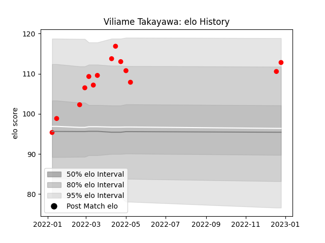

---  
layout: page  
title: Viliame Takayawa  
date: 2023-02-02 19:05:59.085549  
categories: player  
---
# Viliame Takayawa

## Positions: W

## Current elo: 128.0

## Current Percentile: 96.0

# Elo History

# Match History

| Team                  |   Appearances |   Win Rate |
|:----------------------|--------------:|-----------:|
| Yokohama Canon Eagles |            18 |   0.694444 |

| Opponent                          |   Matches |   Win Rate |
|:----------------------------------|----------:|-----------:|
| Green Rockets Tokatsu             |         3 |   1        |
| Kobelco Kobe Steelers             |         3 |   0.666667 |
| Kubota Spears Funabashi Tokyo-Bay |         2 |   0.75     |
| Saitama Wild Knights              |         2 |   0        |
| Black Rams Tokyo                  |         1 |   1        |
| Hanazono Kintetsu Liners          |         1 |   1        |
| NTT Docomo Red Hurricanes Osaka   |         1 |   1        |
| Shizuoka Blue Revs                |         1 |   1        |
| Tokyo Sungoliath                  |         1 |   0        |
| Toshiba Brave Lupus Tokyo         |         1 |   0        |
| Toyota Verblitz                   |         1 |   1        |
| Urayasu D-Rocks                   |         1 |   1        |