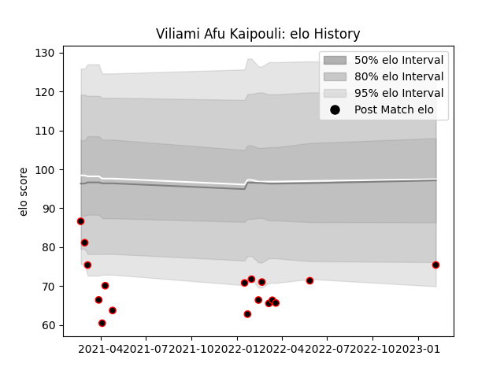

---  
layout: page  
title: Viliami Afu Kaipouli  
date: 2023-02-09 13:56:13.113501  
categories: player  
---
# Viliami Afu Kaipouli

## Positions: N8

## Current elo: 75.0

## Current Percentile: 5.0

# Elo History

# Match History

| Team           |   Appearances |   Win Rate |
|:---------------|--------------:|-----------:|
| Mie Honda Heat |            17 |   0.470588 |

| Opponent                         |   Matches |   Win Rate |
|:---------------------------------|----------:|-----------:|
| Hanazono Kintetsu Liners         |         2 |        0   |
| Hino Red Dolphins                |         2 |        1   |
| Mitsubishi Dynaboars             |         2 |        0.5 |
| Skyactivs Hiroshima              |         2 |        1   |
| Green Rockets Tokatsu            |         1 |        1   |
| Kamaishi Seawaves                |         1 |        1   |
| Munakata Sanix Blues             |         1 |        0   |
| NTT Docomo Red Hurricanes Osaka  |         1 |        0   |
| Tokyo Sungoliath                 |         1 |        0   |
| Toshiba Brave Lupus Tokyo        |         1 |        0   |
| Toyota Industries Shuttles Aichi |         1 |        1   |
| Toyota Verblitz                  |         1 |        0   |
| Urayasu D-Rocks                  |         1 |        0   |