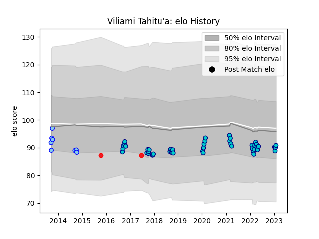

---  
layout: page  
title: Viliami Tahitu'a  
date: 2023-03-21 18:53:04.242728  
categories: player  
---
# Viliami Tahitu'a

Last updated: 2023-03-21
## Positions: C

## Country: Tonga

## Current elo: 99.0

## Current Percentile: 54.0

# Elo History

# Match History

| Team               |   Appearances |   Win Rate |
|:-------------------|--------------:|-----------:|
| Shizuoka Blue Revs |            48 |   0.666667 |
| Northland          |             8 |   0.125    |
| Tonga              |             2 |   0        |

| Opponent                          |   Matches |   Win Rate |
|:----------------------------------|----------:|-----------:|
| Black Rams Tokyo                  |         6 |   0.833333 |
| Yokohama Canon Eagles             |         5 |   0.6      |
| Toshiba Brave Lupus Tokyo         |         5 |   0.4      |
| Kubota Spears Funabashi Tokyo-Bay |         5 |   0.6      |
| Urayasu D-Rocks                   |         4 |   1        |
| Green Rockets Tokatsu             |         3 |   1        |
| Toyota Verblitz                   |         3 |   0.666667 |
| Kobelco Kobe Steelers             |         3 |   0        |
| Munakata Sanix Blues              |         2 |   1        |
| Tokyo Sungoliath                  |         2 |   0        |
| Saitama Wild Knights              |         2 |   0        |
| Auckland                          |         2 |   0        |
| Hino Red Dolphins                 |         2 |   1        |
| Coca-Cola Red Sparks              |         2 |   1        |
| NTT Docomo Red Hurricanes Osaka   |         2 |   1        |
| Mitsubishi Dynaboars              |         1 |   1        |
| New Zealand                       |         1 |   0        |
| North Harbour                     |         1 |   1        |
| Otago                             |         1 |   0        |
| Mie Honda Heat                    |         1 |   1        |
| Southland                         |         1 |   0        |
| Tasman                            |         1 |   0        |
| Manawatu                          |         1 |   0        |
| Hawke's Bay                       |         1 |   0        |
| Wales                             |         1 |   0        |