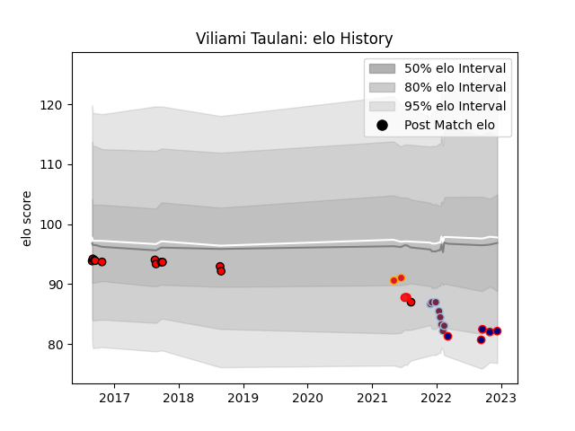

---  
layout: page  
title: Viliami Taulani  
date: 2022-12-18 16:29:16.246365  
categories: player  
---
# Viliami Taulani

## Positions: FL, N8

## Country: Tonga

## Current elo: 82.0

## Current Percentile: 10.0

# Elo History

# Match History

| Team             |   Appearances |   Win Rate |
|:-----------------|--------------:|-----------:|
| Counties Manukau |            12 |      0.375 |
| Harlequins       |             8 |      0.375 |
| London Scottish  |             5 |      0     |
| Tonga            |             3 |      0     |
| Chiefs           |             2 |      0.5   |

| Opponent                 |   Matches |   Win Rate |
|:-------------------------|----------:|-----------:|
| Bay of Plenty            |         3 |        0.5 |
| Taranaki                 |         2 |        0   |
| Samoa                    |         2 |        0   |
| Auckland                 |         1 |        1   |
| Manawatu                 |         1 |        0   |
| Waikato                  |         1 |        0   |
| Saracens                 |         1 |        0   |
| Sale Sharks              |         1 |        0   |
| Nottingham               |         1 |        0   |
| Northland                |         1 |        1   |
| Northampton Saints       |         1 |        1   |
| New Zealand              |         1 |        0   |
| New South Wales Waratahs |         1 |        1   |
| London Irish             |         1 |        0   |
| Bath Rugby               |         1 |        0   |
| Leicester Tigers         |         1 |        0   |
| Hawke's Bay              |         1 |        1   |
| Ealing Trailfinders      |         1 |        0   |
| Doncaster                |         1 |        0   |
| Cornish Pirates          |         1 |        0   |
| Castres Olympique        |         1 |        1   |
| Cardiff Blues            |         1 |        1   |
| Canterbury               |         1 |        0   |
| Blues                    |         1 |        0   |
| Bedford                  |         1 |        0   |
| Wellington               |         1 |        0   |