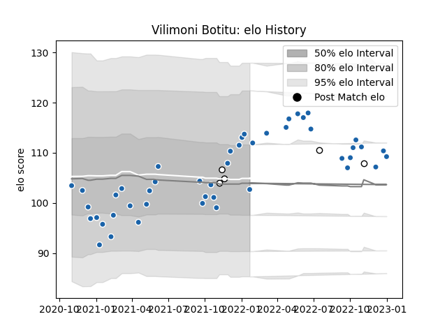

---  
layout: page  
title: Vilimoni Botitu  
date: 2022-12-14 11:29:39.627915  
categories: player  
---
# Vilimoni Botitu

## Positions: C

## Country: Fiji

## Current elo: 98.0

## Current Percentile: 60.0

# Elo History

# Match History

| Team              |   Appearances |   Win Rate |
|:------------------|--------------:|-----------:|
| Castres Olympique |            43 |   0.732558 |
| Fiji              |             5 |   0.3      |

| Opponent             |   Matches |   Win Rate |
|:---------------------|----------:|-----------:|
| Montpellier Herault  |         6 |   0.666667 |
| Bordeaux Begles      |         3 |   0.166667 |
| Brive                |         3 |   1        |
| Clermont Auvergne    |         3 |   0.666667 |
| Stade Toulousain     |         3 |   0.666667 |
| Pau                  |         3 |   1        |
| Perpignan            |         3 |   0.666667 |
| Racing 92            |         3 |   0.666667 |
| Stade Francais Paris |         3 |   0.666667 |
| Biarritz Olympique   |         2 |   1        |
| Toulon               |         2 |   1        |
| La Rochelle          |         2 |   1        |
| Lyon                 |         2 |   1        |
| Bayonne              |         2 |   1        |
| Agen                 |         1 |   1        |
| Spain                |         1 |   1        |
| Ospreys              |         1 |   0        |
| Scotland             |         1 |   0        |
| Samoa                |         1 |   0        |
| Newcastle Falcons    |         1 |   0        |
| Georgia              |         1 |   0.5      |
| Wales                |         1 |   0        |