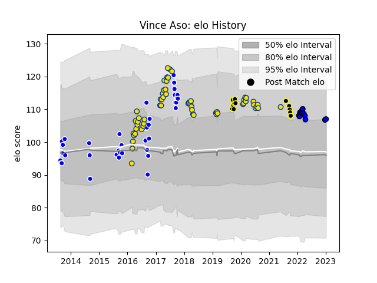

---  
layout: page  
title: Vince Aso  
date: 2022-12-28 12:56:50.337918  
categories: player  
---
# Vince Aso

## Positions: C, W

## Current elo: 106.0

## Current Percentile: 79.0

# Elo History

# Match History

| Team                 |   Appearances |   Win Rate |
|:---------------------|--------------:|-----------:|
| Hurricanes           |            58 |   0.732759 |
| Auckland             |            39 |   0.538462 |
| Saitama Wild Knights |            12 |   1        |
| Wellington           |            12 |   0.583333 |

| Opponent                        |   Matches |   Win Rate |
|:--------------------------------|----------:|-----------:|
| Chiefs                          |         7 |   0.571429 |
| Highlanders                     |         7 |   0.714286 |
| Tasman                          |         6 |   0.416667 |
| Canterbury                      |         6 |   0.333333 |
| Crusaders                       |         5 |   0.4      |
| Blues                           |         5 |   0.6      |
| Otago                           |         5 |   0.6      |
| Northland                       |         5 |   1        |
| Taranaki                        |         4 |   0.25     |
| Sharks                          |         4 |   0.75     |
| Bay of Plenty                   |         4 |   0.75     |
| Lions                           |         4 |   0.75     |
| Waikato                         |         4 |   0.25     |
| Hawke's Bay                     |         3 |   0.333333 |
| Jaguares                        |         3 |   1        |
| Western Force                   |         3 |   1        |
| Sunwolves                       |         3 |   1        |
| Manawatu                        |         3 |   1        |
| Melbourne Rebels                |         3 |   1        |
| North Harbour                   |         3 |   0.333333 |
| Counties Manukau                |         3 |   0.333333 |
| Brumbies                        |         3 |   0.666667 |
| Southland                       |         3 |   0.833333 |
| Shizuoka Blue Revs              |         2 |   1        |
| Stormers                        |         2 |   0.5      |
| Bulls                           |         2 |   0.5      |
| Queensland Reds                 |         2 |   1        |
| Urayasu D-Rocks                 |         2 |   1        |
| Kobelco Kobe Steelers           |         2 |   1        |
| New South Wales Waratahs        |         2 |   1        |
| Wellington                      |         1 |   1        |
| Toyota Verblitz                 |         1 |   1        |
| Toshiba Brave Lupus Tokyo       |         1 |   1        |
| Auckland                        |         1 |   1        |
| Tokyo Sungoliath                |         1 |   1        |
| Southern Kings                  |         1 |   1        |
| NTT Docomo Red Hurricanes Osaka |         1 |   1        |
| Cheetahs                        |         1 |   1        |
| British and Irish Lions         |         1 |   0.5      |
| Black Rams Tokyo                |         1 |   1        |
| Yokohama Canon Eagles           |         1 |   1        |