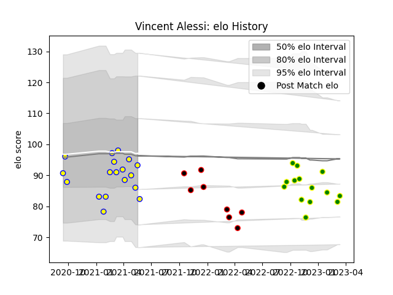

---  
layout: page  
title: Vincent Alessi  
date: 2022-12-09 13:23:22.146971  
categories: player  
---
# Vincent Alessi

## Positions: W

## Current elo: 76.0

## Current Percentile: 4.0

# Elo History

# Match History

| Team                |   Appearances |   Win Rate |
|:--------------------|--------------:|-----------:|
| Aubenas             |            17 |   0.264706 |
| Carqueiranne-Hyères |             9 |   0.444444 |
| Nice                |             8 |   0.375    |

| Opponent                   |   Matches |   Win Rate |
|:---------------------------|----------:|-----------:|
| Chambery                   |         4 |   0.75     |
| Massy                      |         4 |   0.25     |
| Suresnes                   |         4 |   0.25     |
| Albi                       |         3 |   0.333333 |
| Blagnac                    |         3 |   0.333333 |
| Tarbes                     |         3 |   0.666667 |
| Cognac Saint Jean d'Angély |         2 |   0.5      |
| Dijon                      |         2 |   0.25     |
| Narbonne                   |         2 |   0        |
| US Bressane                |         2 |   0        |
| Bourgoin-Jallieu           |         1 |   1        |
| Dax                        |         1 |   0        |
| Nice                       |         1 |   0        |
| Rennes                     |         1 |   0        |
| Valence Romans Drome Rugby |         1 |   0        |