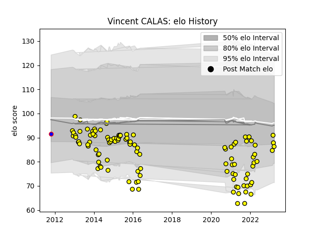

---  
layout: page  
title: Vincent CALAS  
date: 2023-03-29 11:28:57.572985  
categories: player  
---
# Vincent CALAS

Last updated: 2023-03-29
## Positions: FL

## Current elo: 86.0

## Current Percentile: 25.0

# Elo History

# Match History

| Team    |   Appearances |   Win Rate |
|:--------|--------------:|-----------:|
| Albi    |           108 |        0.5 |
| Beziers |             1 |        0   |

| Opponent                   |   Matches |   Win Rate |
|:---------------------------|----------:|-----------:|
| Dax                        |        11 |   0.863636 |
| Bourgoin-Jallieu           |         8 |   0.75     |
| Carcassonne                |         5 |   0.8      |
| Aurillac                   |         5 |   0.6      |
| Narbonne                   |         5 |   0.4      |
| Pau                        |         4 |   0.25     |
| La Rochelle                |         4 |   0        |
| Mont-de-Marsan             |         4 |   0        |
| Nice                       |         4 |   0.375    |
| Lyon                       |         4 |   0        |
| Provence Rugby             |         4 |   0.5      |
| Suresnes                   |         4 |   0.75     |
| Beziers                    |         4 |   0.25     |
| Tarbes                     |         4 |   0        |
| Massy                      |         3 |   0.666667 |
| Montauban                  |         3 |   0        |
| US Bressane                |         3 |   0.333333 |
| Dijon                      |         3 |   1        |
| Valence Romans Drome Rugby |         3 |   0.333333 |
| Aubenas                    |         3 |   1        |
| Cognac Saint Jean d'Angély |         3 |   0.666667 |
| Chambery                   |         3 |   1        |
| Blagnac                    |         3 |   0.666667 |
| Perpignan                  |         2 |   1        |
| Biarritz Olympique         |         2 |   1        |
| Bayonne                    |         2 |   0        |
| Agen                       |         2 |   0        |
| Colomiers                  |         1 |   0        |
| Oyonnax                    |         1 |   0        |
| Brive                      |         1 |   0        |
| Auch                       |         1 |   0        |