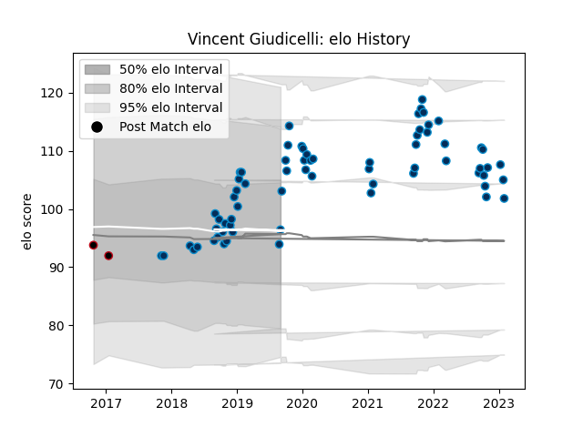

---  
layout: page  
title: Vincent Giudicelli  
date: 2023-01-13 11:26:08.386035  
categories: player  
---
# Vincent Giudicelli

## Positions: H

## Current elo: 96.0

## Current Percentile: 75.0

# Elo History

# Match History

| Team                |   Appearances |   Win Rate |
|:--------------------|--------------:|-----------:|
| Montpellier Herault |            66 |   0.477273 |
| Lyon                |             2 |   0        |

| Opponent             |   Matches |   Win Rate |
|:---------------------|----------:|-----------:|
| Lyon                 |         7 |   0.285714 |
| La Rochelle          |         6 |   0.666667 |
| Stade Toulousain     |         6 |   0.5      |
| Castres Olympique    |         6 |   0.166667 |
| Racing 92            |         5 |   0.4      |
| Pau                  |         5 |   0.6      |
| Stade Francais Paris |         4 |   0.625    |
| Toulon               |         4 |   0.5      |
| Clermont Auvergne    |         4 |   0.25     |
| Brive                |         4 |   0.75     |
| Bordeaux Begles      |         4 |   0.5      |
| Bayonne              |         2 |   0.5      |
| Edinburgh            |         2 |   0.5      |
| Newcastle Falcons    |         2 |   0.5      |
| Ospreys              |         2 |   0        |
| Perpignan            |         2 |   0.5      |
| Gloucester Rugby     |         1 |   0        |
| Connacht             |         1 |   1        |
| Agen                 |         1 |   1        |