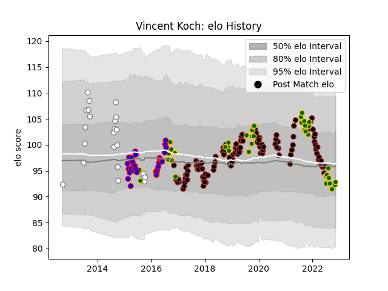

---  
layout: page  
title: Vincent Koch  
date: 2022-11-22 11:34:33.452992  
categories: player  
---
# Vincent Koch

## Positions: P

## Country: South Africa

## Current elo: 94.0

## Current Percentile: 49.0

# Elo History

# Match History

| Team         |   Appearances |   Win Rate |
|:-------------|--------------:|-----------:|
| Saracens     |           114 |   0.72807  |
| South Africa |            41 |   0.560976 |
| Stormers     |            32 |   0.625    |
| Pumas        |            24 |   0.604167 |

| Opponent                 |   Matches |   Win Rate |
|:-------------------------|----------:|-----------:|
| Exeter Chiefs            |        10 |   0.45     |
| Wasps                    |        10 |   0.6      |
| Bath Rugby               |         8 |   0.5625   |
| Harlequins               |         8 |   0.75     |
| Northampton Saints       |         8 |   1        |
| New Zealand              |         8 |   0.25     |
| Gloucester Rugby         |         7 |   0.428571 |
| Wales                    |         6 |   0.666667 |
| Sale Sharks              |         6 |   0.833333 |
| Bristol Rugby            |         6 |   0.666667 |
| Argentina                |         6 |   0.666667 |
| Leicester Tigers         |         6 |   0.666667 |
| Worcester Warriors       |         5 |   1        |
| London Irish             |         5 |   0.8      |
| Newcastle Falcons        |         5 |   1        |
| Australia                |         5 |   0.4      |
| Cheetahs                 |         4 |   0.75     |
| Glasgow Warriors         |         4 |   1        |
| Munster                  |         3 |   1        |
| Natal Sharks             |         3 |   0.333333 |
| Lions                    |         3 |   0.5      |
| Free State Cheetahs      |         3 |   0.833333 |
| Ospreys                  |         3 |   0.833333 |
| Racing 92                |         3 |   0.333333 |
| Sharks                   |         3 |   0.333333 |
| Italy                    |         3 |   0.666667 |
| Brumbies                 |         3 |   0.666667 |
| England                  |         3 |   0.333333 |
| Eastern Province Kings   |         3 |   0.666667 |
| Bulls                    |         3 |   0.666667 |
| Clermont Auvergne        |         3 |   0.333333 |
| France                   |         2 |   0.5      |
| Melbourne Rebels         |         2 |   1        |
| Chiefs                   |         2 |   0        |
| New South Wales Waratahs |         2 |   0.5      |
| Boland Cavaliers         |         2 |   1        |
| British and Irish Lions  |         2 |   1        |
| Scotland                 |         2 |   1        |
| Sunwolves                |         2 |   0.75     |
| Blue Bulls               |         2 |   0        |
| Western Force            |         2 |   1        |
| Western Province         |         2 |   0        |
| Lyon                     |         2 |   1        |
| Cardiff Blues            |         2 |   1        |
| Leinster                 |         2 |   1        |
| Griffons                 |         2 |   1        |
| Griquas                  |         2 |   0.5      |
| Cornish Pirates          |         1 |   0        |
| Ireland                  |         1 |   0        |
| Golden Lions             |         1 |   0        |
| Bedford                  |         1 |   1        |
| Valke                    |         1 |   1        |
| Highlanders              |         1 |   0        |
| Southern Kings           |         1 |   1        |
| Blues                    |         1 |   1        |
| Hurricanes               |         1 |   0        |
| Scarlets                 |         1 |   0.5      |
| SWD Eagles               |         1 |   1        |
| Leopards                 |         1 |   1        |
| Richmond                 |         1 |   1        |
| Border Bulldogs          |         1 |   1        |
| Queensland Reds          |         1 |   1        |
| Ealing Trailfinders      |         1 |   1        |
| Jaguares                 |         1 |   1        |
| Japan                    |         1 |   1        |
| Canada                   |         1 |   1        |
| Jersey                   |         1 |   1        |
| Doncaster                |         1 |   1        |
| Namibia                  |         1 |   1        |
| Ampthill                 |         1 |   1        |