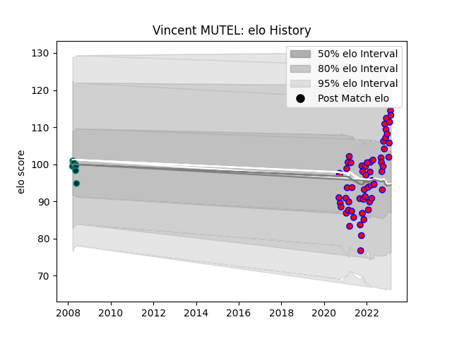

---  
layout: page  
title: Vincent MUTEL  
date: 2023-03-06 11:25:33.181394  
categories: player  
---
# Vincent MUTEL

## Positions: L

## Current elo: 114.0

## Current Percentile: 92.0

# Elo History

# Match History

| Team    |   Appearances |   Win Rate |
|:--------|--------------:|-----------:|
| Blagnac |            61 |    0.52459 |
| Pau     |             8 |    0.625   |

| Opponent                   |   Matches |   Win Rate |
|:---------------------------|----------:|-----------:|
| Tarbes                     |         6 |   0.75     |
| Cognac Saint Jean d'Angély |         6 |   0.666667 |
| Chambery                   |         5 |   0.8      |
| Dax                        |         5 |   0.6      |
| Suresnes                   |         4 |   0.5      |
| Massy                      |         4 |   0.5      |
| Albi                       |         4 |   0.25     |
| Valence Romans Drome Rugby |         4 |   0.5      |
| Bourgoin-Jallieu           |         4 |   0.5      |
| US Bressane                |         4 |   0.25     |
| Aubenas                    |         4 |   0.75     |
| Dijon                      |         3 |   0.333333 |
| Narbonne                   |         3 |   0.166667 |
| Soyaux-Angouleme           |         2 |   0        |
| Nice                       |         2 |   0.5      |
| Rennes                     |         1 |   1        |
| Toulon                     |         1 |   1        |
| Agen                       |         1 |   0        |
| Limoges                    |         1 |   1        |
| Carqueiranne-Hyères        |         1 |   1        |
| Blagnac                    |         1 |   1        |
| Beziers                    |         1 |   0        |
| Aurillac                   |         1 |   0        |
| La Rochelle                |         1 |   1        |