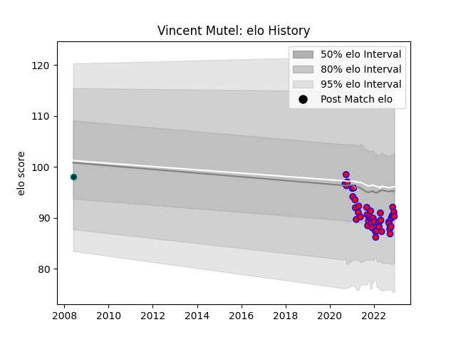

---  
layout: page  
title: Vincent Mutel  
date: 2022-11-15 23:43:45.137241  
categories: player  
---
# Vincent Mutel

## Positions: L

## Current elo: 92.0

## Current Percentile: 26.0

# Elo History

# Match History

| Team    |   Appearances |   Win Rate |
|:--------|--------------:|-----------:|
| Blagnac |            41 |   0.487805 |
| Pau     |             1 |   0        |

| Opponent                   |   Matches |   Win Rate |
|:---------------------------|----------:|-----------:|
| Cognac Saint Jean d'Angély |         5 |   0.6      |
| Massy                      |         4 |   0.5      |
| US Bressane                |         3 |   0        |
| Aubenas                    |         3 |   0.666667 |
| Dijon                      |         3 |   0.333333 |
| Albi                       |         3 |   0.333333 |
| Chambery                   |         3 |   1        |
| Bourgoin-Jallieu           |         3 |   0.333333 |
| Dax                        |         2 |   0.5      |
| Narbonne                   |         2 |   0        |
| Soyaux-Angouleme           |         2 |   0        |
| Suresnes                   |         2 |   0.5      |
| Tarbes                     |         2 |   1        |
| Carqueiranne-Hyères        |         1 |   1        |
| Nice                       |         1 |   1        |
| Rennes                     |         1 |   1        |
| Aurillac                   |         1 |   0        |
| Valence Romans Drome Rugby |         1 |   0        |