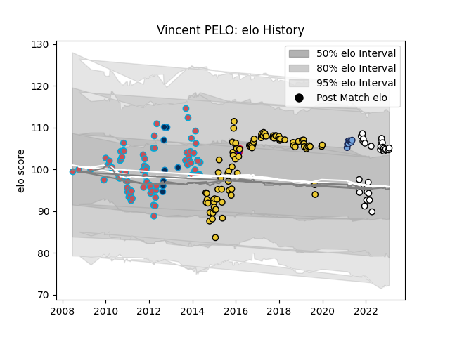

---  
layout: page  
title: Vincent PELO  
date: 2023-01-27 19:00:27.919616  
categories: player  
---
# Vincent PELO

## Positions: P

## Country: France

## Current elo: 105.0

## Current Percentile: 78.0

# Elo History

# Match History

| Team                       |   Appearances |   Win Rate |
|:---------------------------|--------------:|-----------:|
| La Rochelle                |            96 |   0.505208 |
| Bourgoin-Jallieu           |            77 |   0.376623 |
| Valence Romans Drome Rugby |            29 |   0.637931 |
| Bayonne                    |             8 |   0.5      |
| Montpellier Herault        |             8 |   0.625    |
| France                     |             2 |   0        |

| Opponent                   |   Matches |   Win Rate |
|:---------------------------|----------:|-----------:|
| Clermont Auvergne          |        12 |  0.208333  |
| Toulon                     |        11 |  0.363636  |
| Brive                      |        10 |  0.6       |
| Stade Toulousain           |        10 |  0.5       |
| Racing 92                  |        10 |  0.45      |
| Agen                       |         9 |  0.888889  |
| Montpellier Herault        |         8 |  0.1875    |
| Grenoble                   |         8 |  0.625     |
| Bordeaux Begles            |         8 |  0.5       |
| Stade Francais Paris       |         7 |  0.285714  |
| Castres Olympique          |         7 |  0.285714  |
| Lyon                       |         7 |  0.5       |
| Bayonne                    |         7 |  0.571429  |
| Oyonnax                    |         6 |  0.75      |
| Tarbes                     |         6 |  0.5       |
| Pau                        |         6 |  0.5       |
| La Rochelle                |         6 |  0.0833333 |
| Dax                        |         6 |  0.583333  |
| Albi                       |         5 |  0.4       |
| Aurillac                   |         4 |  0.5       |
| Perpignan                  |         4 |  0.25      |
| Narbonne                   |         4 |  0.5       |
| Bourgoin-Jallieu           |         3 |  0.5       |
| Gloucester Rugby           |         3 |  0         |
| Carcassonne                |         3 |  0.666667  |
| Cognac Saint Jean d'Angély |         3 |  1         |
| Périgueux                  |         2 |  1         |
| Provence Rugby             |         2 |  0.5       |
| Sale Sharks                |         2 |  1         |
| Auch                       |         2 |  0.5       |
| Suresnes                   |         2 |  1         |
| Ulster                     |         2 |  0.5       |
| Rennes                     |         2 |  1         |
| Nice                       |         2 |  1         |
| Zebre                      |         2 |  0.5       |
| Biarritz Olympique         |         2 |  0         |
| Mont-de-Marsan             |         2 |  0.5       |
| Beziers                    |         2 |  0.5       |
| Exeter Chiefs              |         2 |  0         |
| Connacht                   |         2 |  0         |
| Blagnac                    |         2 |  0.5       |
| Worcester Warriors         |         1 |  0         |
| Wasps                      |         1 |  0         |
| Wales                      |         1 |  0         |
| Carqueiranne-Hyères        |         1 |  1         |
| US Bressane                |         1 |  0         |
| Aubenas                    |         1 |  1         |
| Chambery                   |         1 |  1         |
| Benetton Treviso           |         1 |  1         |
| Colomiers                  |         1 |  0         |
| Montauban                  |         1 |  1         |
| Scotland                   |         1 |  0         |
| Dijon                      |         1 |  0         |
| RC Enisei                  |         1 |  1         |
| Glasgow Warriors           |         1 |  1         |
| Harlequins                 |         1 |  1         |
| Massy                      |         1 |  0         |
| Soyaux-Angouleme           |         1 |  0         |