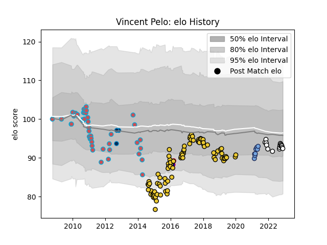

---  
layout: page  
title: Vincent Pelo  
date: 2022-11-22 11:34:41.426964  
categories: player  
---
# Vincent Pelo

## Positions: P

## Country: France

## Current elo: 92.0

## Current Percentile: 35.0

# Elo History

# Match History

| Team                       |   Appearances |   Win Rate |
|:---------------------------|--------------:|-----------:|
| La Rochelle                |            93 |   0.510753 |
| Bourgoin-Jallieu           |            46 |   0.25     |
| Valence Romans Drome Rugby |            16 |   0.65625  |
| Bayonne                    |             8 |   0.5      |
| Montpellier Herault        |             3 |   0.333333 |
| France                     |             2 |   0        |

| Opponent                   |   Matches |   Win Rate |
|:---------------------------|----------:|-----------:|
| Toulon                     |        11 |   0.363636 |
| Stade Toulousain           |        10 |   0.5      |
| Racing 92                  |        10 |   0.45     |
| Brive                      |         9 |   0.555556 |
| Clermont Auvergne          |         9 |   0.166667 |
| Montpellier Herault        |         8 |   0.1875   |
| Agen                       |         7 |   0.857143 |
| Castres Olympique          |         7 |   0.285714 |
| Bayonne                    |         7 |   0.571429 |
| Bordeaux Begles            |         7 |   0.428571 |
| Grenoble                   |         7 |   0.714286 |
| Stade Francais Paris       |         5 |   0.2      |
| La Rochelle                |         5 |   0.1      |
| Lyon                       |         5 |   0.5      |
| Oyonnax                    |         4 |   0.875    |
| Pau                        |         4 |   0.5      |
| Dax                        |         3 |   0.666667 |
| Gloucester Rugby           |         3 |   0        |
| Bourgoin-Jallieu           |         3 |   0.5      |
| Perpignan                  |         3 |   0        |
| Albi                       |         3 |   0.333333 |
| Biarritz Olympique         |         2 |   0        |
| Ulster                     |         2 |   0.5      |
| Tarbes                     |         2 |   0.5      |
| Aurillac                   |         2 |   0.5      |
| Sale Sharks                |         2 |   1        |
| Zebre                      |         2 |   0.5      |
| Connacht                   |         2 |   0        |
| Exeter Chiefs              |         2 |   0        |
| Mont-de-Marsan             |         1 |   0        |
| Montauban                  |         1 |   1        |
| Worcester Warriors         |         1 |   0        |
| Wasps                      |         1 |   0        |
| Wales                      |         1 |   0        |
| Cognac Saint Jean d'Angély |         1 |   1        |
| Aubenas                    |         1 |   1        |
| Suresnes                   |         1 |   1        |
| Auch                       |         1 |   0        |
| Soyaux-Angouleme           |         1 |   0        |
| Scotland                   |         1 |   0        |
| Glasgow Warriors           |         1 |   1        |
| Rennes                     |         1 |   1        |
| Benetton Treviso           |         1 |   1        |
| RC Enisei                  |         1 |   1        |
| Harlequins                 |         1 |   1        |
| Blagnac                    |         1 |   1        |
| Carcassonne                |         1 |   0        |
| Nice                       |         1 |   1        |
| Narbonne                   |         1 |   1        |
| Massy                      |         1 |   0        |
| Carqueiranne-Hyères        |         1 |   1        |