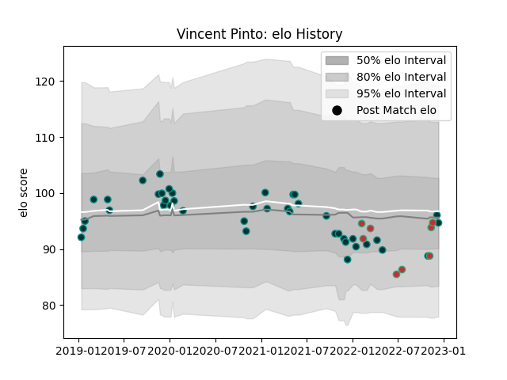

---  
layout: page  
title: Vincent Pinto  
date: 2022-12-18 16:20:37.012680  
categories: player  
---
# Vincent Pinto

## Positions: W

## Country: Portugal

## Current elo: 95.0

## Current Percentile: 51.0

# Elo History

# Match History

| Team     |   Appearances |   Win Rate |
|:---------|--------------:|-----------:|
| Pau      |            41 |   0.378049 |
| Portugal |             8 |   0.375    |

| Opponent                 |   Matches |   Win Rate |
|:-------------------------|----------:|-----------:|
| La Rochelle              |         6 |   0.166667 |
| Brive                    |         4 |   0.25     |
| Clermont Auvergne        |         3 |   0.333333 |
| Toulon                   |         3 |   0.166667 |
| Racing 92                |         3 |   0.333333 |
| Georgia                  |         2 |   0.25     |
| Leicester Tigers         |         2 |   0.5      |
| Bayonne                  |         2 |   1        |
| Agen                     |         2 |   1        |
| Stade Francais Paris     |         2 |   0        |
| Castres Olympique        |         2 |   0        |
| Cardiff Blues            |         2 |   0.5      |
| Calvisano                |         2 |   1        |
| Ospreys                  |         1 |   1        |
| Spain                    |         1 |   0        |
| Romania                  |         1 |   0        |
| Stade Toulousain         |         1 |   0        |
| Perpignan                |         1 |   1        |
| Italy                    |         1 |   0        |
| London Irish             |         1 |   0        |
| Kenya                    |         1 |   1        |
| Hong Kong                |         1 |   1        |
| Edinburgh                |         1 |   0        |
| Cheetahs                 |         1 |   0        |
| Bordeaux Begles          |         1 |   0        |
| Biarritz Olympique       |         1 |   1        |
| United States of America |         1 |   0.5      |