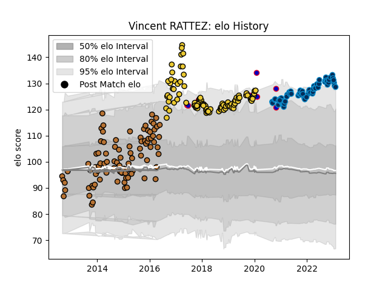

---  
layout: page  
title: Vincent RATTEZ  
date: 2023-02-05 15:12:12.741842  
categories: player  
---
# Vincent RATTEZ

## Positions: W, FB

## Country: France

## Current elo: 129.0

## Current Percentile: 96.0

# Elo History

# Match History

| Team                |   Appearances |   Win Rate |
|:--------------------|--------------:|-----------:|
| La Rochelle         |            98 |   0.612245 |
| Narbonne            |            93 |   0.462366 |
| Montpellier Herault |            64 |   0.570312 |
| France              |             8 |   0.5      |

| Opponent               |   Matches |   Win Rate |
|:-----------------------|----------:|-----------:|
| Lyon                   |        17 |   0.411765 |
| Pau                    |        15 |   0.6      |
| Bordeaux Begles        |        12 |   0.416667 |
| Castres Olympique      |        11 |   0.454545 |
| Stade Toulousain       |        11 |   0.454545 |
| Racing 92              |        11 |   0.681818 |
| Agen                   |        10 |   0.7      |
| Toulon                 |        10 |   0.4      |
| Clermont Auvergne      |         9 |   0.388889 |
| Perpignan              |         8 |   0.875    |
| Stade Francais Paris   |         7 |   0.714286 |
| Albi                   |         7 |   0.571429 |
| Dax                    |         7 |   0.714286 |
| Colomiers              |         7 |   0.285714 |
| La Rochelle            |         7 |   0.571429 |
| Aurillac               |         7 |   0.571429 |
| Brive                  |         7 |   0.5      |
| Carcassonne            |         6 |   0.666667 |
| Bourgoin-Jallieu       |         6 |   0.416667 |
| Tarbes                 |         6 |   0.416667 |
| Bayonne                |         6 |   0.5      |
| Beziers                |         6 |   0.5      |
| Biarritz Olympique     |         6 |   0.333333 |
| Mont-de-Marsan         |         5 |   0.2      |
| Montpellier Herault    |         5 |   0.6      |
| Montauban              |         4 |   0.75     |
| Harlequins             |         3 |   1        |
| Grenoble               |         3 |   1        |
| Gloucester Rugby       |         3 |   0.333333 |
| Exeter Chiefs          |         3 |   0.333333 |
| Oyonnax                |         2 |   0.75     |
| Wales                  |         2 |   0.5      |
| Ulster                 |         2 |   0.5      |
| Auch                   |         2 |   0.5      |
| Bristol Rugby          |         2 |   1        |
| South Africa           |         2 |   0        |
| Sale Sharks            |         2 |   0.5      |
| Provence Rugby         |         2 |   0.5      |
| Benetton Treviso       |         2 |   1        |
| Glasgow Warriors       |         2 |   0.5      |
| Massy                  |         2 |   0.5      |
| Ospreys                |         1 |   0        |
| Edinburgh              |         1 |   1        |
| Wasps                  |         1 |   1        |
| Italy                  |         1 |   1        |
| Leicester Tigers       |         1 |   1        |
| US Bressane            |         1 |   1        |
| Leinster               |         1 |   0        |
| London Irish           |         1 |   0.5      |
| Bath Rugby             |         1 |   1        |
| Enisey-STM Krasnoyarsk |         1 |   1        |
| Scarlets               |         1 |   0        |
| England                |         1 |   1        |
| RC Enisei              |         1 |   1        |
| New Zealand            |         1 |   0        |
| Ireland                |         1 |   1        |
| Zebre                  |         1 |   1        |