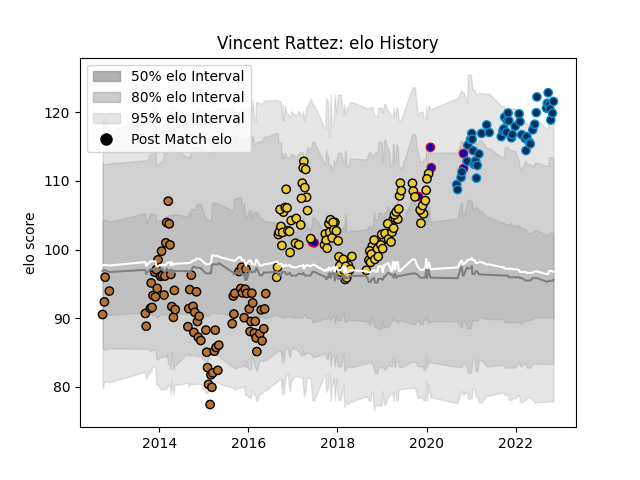

---  
layout: page  
title: Vincent Rattez  
date: 2022-11-16 11:41:37.271465  
categories: player  
---
# Vincent Rattez

## Positions: W, FB

## Country: France

## Current elo: 122.0

## Current Percentile: 95.0

# Elo History

# Match History

| Team                |   Appearances |   Win Rate |
|:--------------------|--------------:|-----------:|
| La Rochelle         |            97 |   0.608247 |
| Narbonne            |            82 |   0.5      |
| Montpellier Herault |            50 |   0.56     |
| France              |             8 |   0.5      |

| Opponent             |   Matches |   Win Rate |
|:---------------------|----------:|-----------:|
| Lyon                 |        17 |   0.411765 |
| Pau                  |        15 |   0.6      |
| Castres Olympique    |        11 |   0.454545 |
| Bordeaux Begles      |        11 |   0.454545 |
| Stade Toulousain     |        11 |   0.454545 |
| Racing 92            |        10 |   0.65     |
| Toulon               |         9 |   0.444444 |
| Clermont Auvergne    |         9 |   0.388889 |
| Agen                 |         8 |   0.875    |
| Stade Francais Paris |         7 |   0.714286 |
| Dax                  |         7 |   0.714286 |
| Perpignan            |         6 |   1        |
| Colomiers            |         6 |   0.333333 |
| Aurillac             |         6 |   0.5      |
| Beziers              |         6 |   0.5      |
| Albi                 |         6 |   0.666667 |
| Biarritz Olympique   |         6 |   0.333333 |
| La Rochelle          |         6 |   0.666667 |
| Carcassonne          |         6 |   0.666667 |
| Brive                |         6 |   0.583333 |
| Tarbes               |         5 |   0.5      |
| Bayonne              |         5 |   0.4      |
| Montpellier Herault  |         5 |   0.6      |
| Bourgoin-Jallieu     |         5 |   0.5      |
| Mont-de-Marsan       |         4 |   0.25     |
| Montauban            |         3 |   0.666667 |
| Gloucester Rugby     |         3 |   0.333333 |
| Grenoble             |         3 |   1        |
| Massy                |         2 |   0.5      |
| Harlequins           |         2 |   1        |
| Ulster               |         2 |   0.5      |
| Exeter Chiefs        |         2 |   0        |
| Oyonnax              |         2 |   0.75     |
| Wales                |         2 |   0.5      |
| Provence Rugby       |         2 |   0.5      |
| Bristol Rugby        |         2 |   1        |
| Benetton Treviso     |         2 |   1        |
| Sale Sharks          |         2 |   0.5      |
| Auch                 |         2 |   0.5      |
| South Africa         |         2 |   0        |
| US Bressane          |         1 |   1        |
| Wasps                |         1 |   1        |
| Italy                |         1 |   1        |
| Scarlets             |         1 |   0        |
| RC Enisei            |         1 |   1        |
| New Zealand          |         1 |   0        |
| Ireland              |         1 |   1        |
| Glasgow Warriors     |         1 |   0        |
| England              |         1 |   1        |
| Edinburgh            |         1 |   1        |
| Zebre                |         1 |   1        |