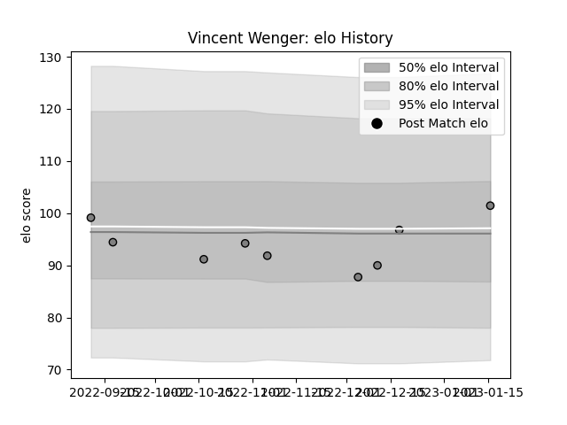

---  
layout: page  
title: Vincent Wenger  
date: 2022-12-18 16:38:08.013148  
categories: player  
---
# Vincent Wenger

## Positions: FL

## Current elo: 88.0

## Current Percentile: 21.0

# Elo History

# Match History

| Team   |   Appearances |   Win Rate |
|:-------|--------------:|-----------:|
| Rennes |             7 |          0 |

| Opponent                   |   Matches |   Win Rate |
|:---------------------------|----------:|-----------:|
| Albi                       |         1 |          0 |
| Blagnac                    |         1 |          0 |
| Bourgoin-Jallieu           |         1 |          0 |
| Chambery                   |         1 |          0 |
| Dax                        |         1 |          0 |
| Nice                       |         1 |          0 |
| Valence Romans Drome Rugby |         1 |          0 |