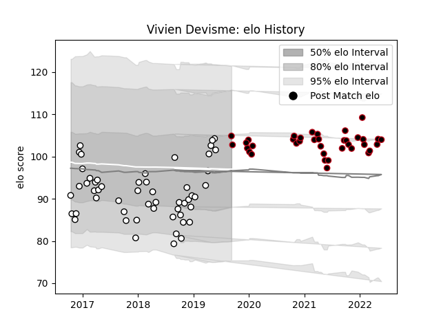

---  
layout: page  
title: Vivien Devisme  
date: 2023-02-24 02:22:50.244113  
categories: player  
---
# Vivien Devisme

## Positions: P

## Current elo: 105.0

## Current Percentile: 66.0

# Elo History

# Match History

| Team   |   Appearances |   Win Rate |
|:-------|--------------:|-----------:|
| Brive  |            53 |   0.5      |
| Lyon   |            37 |   0.702703 |

| Opponent               |   Matches |   Win Rate |
|:-----------------------|----------:|-----------:|
| Bayonne                |         7 |   0.571429 |
| Castres Olympique      |         5 |   0.4      |
| Agen                   |         4 |   0.75     |
| Montpellier Herault    |         4 |   0.75     |
| La Rochelle            |         4 |   0.25     |
| Clermont Auvergne      |         4 |   0.5      |
| Stade Francais Paris   |         4 |   0.25     |
| Stade Toulousain       |         4 |   0.75     |
| Toulon                 |         4 |   1        |
| Bordeaux Begles        |         3 |   0        |
| Brive                  |         3 |   1        |
| Biarritz Olympique     |         3 |   0.833333 |
| Perpignan              |         3 |   1        |
| Oyonnax                |         3 |   0.666667 |
| Racing 92              |         2 |   0        |
| RC Enisei              |         2 |   1        |
| Pau                    |         2 |   0.5      |
| Vannes                 |         2 |   1        |
| Nevers                 |         2 |   1        |
| Worcester Warriors     |         2 |   0.5      |
| Aurillac               |         2 |   0.5      |
| Lyon                   |         2 |   0.5      |
| Benetton Treviso       |         2 |   0.5      |
| Dragons                |         2 |   0.5      |
| Colomiers              |         2 |   0.5      |
| Mont-de-Marsan         |         1 |   0        |
| Soyaux-Angouleme       |         1 |   1        |
| Bath Rugby             |         1 |   0        |
| US Bressane            |         1 |   1        |
| Beziers                |         1 |   1        |
| Carcassonne            |         1 |   1        |
| Connacht               |         1 |   0        |
| Montauban              |         1 |   1        |
| Provence Rugby         |         1 |   0        |
| Enisey-STM Krasnoyarsk |         1 |   1        |
| Exeter Chiefs          |         1 |   0        |
| Northampton Saints     |         1 |   0        |
| Massy                  |         1 |   0        |